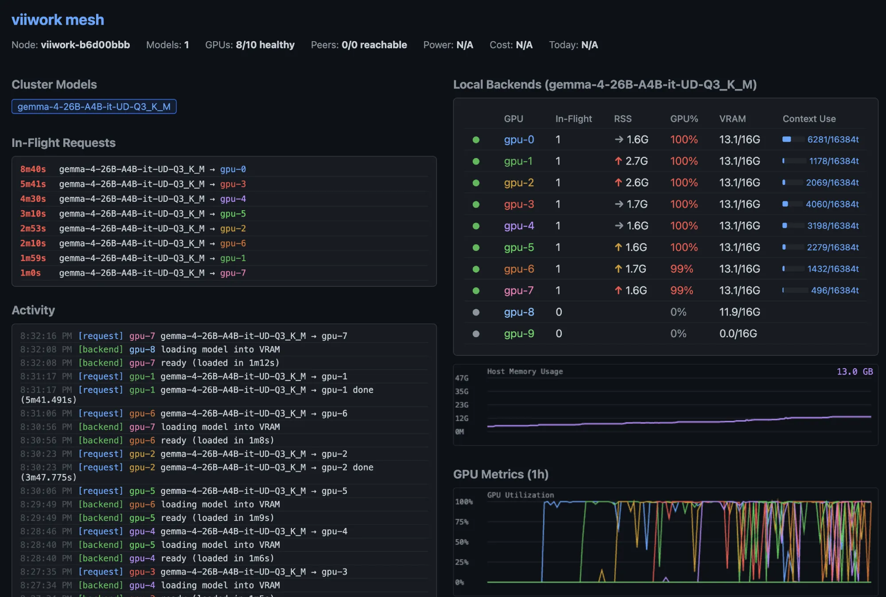

# viiwork

LLM inference load balancer for AMD Radeon VII GPUs. Runs multiple llama-server instances and exposes a single OpenAI-compatible API with adaptive load balancing. Multiple nodes can form a mesh cluster where any node is an entry point and requests route by model.



## Background

I had 50 Radeon VII cards sitting in servers in my mother-in-law's garage (who doesn't?) and wanted to do something useful with them. viiwork was born out of that — a way to turn a pile of aging-but-capable GPUs into a practical LLM inference cluster.

The Radeon VII, Instinct MI50/MI60 are all gfx906 cards with 16GB HBM2 (32GB for MI60) and a 1 TB/s memory bus — legacy hardware that punches well above its weight for LLM inference where memory bandwidth is the bottleneck. These cards are cheap secondhand and still very capable.

viiwork is designed to be useful at any scale: a single old gaming GPU on your desktop, a few Radeon Pro VII cards in a workstation, or racks of Instinct MI50s in your mother-in-law's garage. Use it standalone as an OpenAI-compatible API, or connect it to any MCP-compatible AI assistant via the built-in MCP server.

## Quick Start

```bash
# 1. Interactive setup (recommended) — detects GPUs, picks models, downloads, generates configs
./scripts/setup-node.sh

# 2. Build and run
docker compose up -d

# 3. Test
curl http://localhost:8080/v1/models
curl http://localhost:8080/v1/chat/completions \
  -H "Content-Type: application/json" \
  -d '{"model":"your-model-name","messages":[{"role":"user","content":"Hello"}]}'
```

Or manual setup:

```bash
cp viiwork.yaml.example viiwork.yaml
# Edit viiwork.yaml: set model path, GPU count, etc.
mkdir -p models
huggingface-cli download unsloth/gemma-4-26B-A4B-it-GGUF \
  gemma-4-26B-A4B-it-UD-Q3_K_M.gguf --local-dir models
docker compose up -d
```

## Multi-Model Setup

Run multiple models on one host using `./scripts/setup-node.sh`. It detects GPUs, lets you assign models to GPU groups, downloads models, and generates configs with mesh peering between instances. Supports both **replica mode** (one backend per GPU, N-way concurrency) and **tensor-split mode** (one backend spanning multiple GPUs for models too large for a single card).

Example: 10 GPUs split across 3 models:
- 4 GPUs on port 8080: Gemma-4-26B-A4B-IT (replica mode, 4-way concurrency)
- 4 GPUs on port 8081: Qwen3-32B (replica mode, aggressive quant to fit 16GB)
- 2 GPUs on port 8082: Gemma-4-31B-IT (tensor-split, full quality Q4_K_M across 2 GPUs)

All models visible from any port via mesh routing.

### "I'm Feeling Lucky" Mode

The setup script can auto-discover trending models that fit your hardware:

```bash
./scripts/setup-node.sh
# At the model prompt, enter:
#   0   — any category (surprise me)
#   0c  — coding models
#   0r  — reasoning models
#   0v  — vision/multimodal
#   0w  — writing/chat
#   0l  — multilingual
#   0a  — agentic models
```

Uses [llmfit](https://www.llmfit.org/) for hardware-aware scoring when installed, with HuggingFace API as fallback. Auto-picks a diverse assortment and assigns GPUs.

## Tensor-Split Mode

For models that don't fit in a single GPU's VRAM, tensor-split mode runs one llama-server process spanning multiple GPUs. The model's layers are distributed across GPUs, with cross-GPU traffic at layer boundaries.

```yaml
gpus:
  devices: [0, 1]
  base_port: 9001
  tensor_split:
    enabled: true
    mode: layer    # "layer" recommended; "row" is broken on the gfx906 fork
model:
  parallel: 1      # forced to 1 in tensor-split mode
```

Trade-offs vs replica mode:

| | Replica mode | Tensor-split mode |
|---|---|---|
| Concurrency | N backends = N-way parallel | 1 backend = serial requests |
| Model size cap | Must fit in 1 GPU | Can span N GPUs |
| Throughput | Higher (parallel) | Lower (serial) |
| Use case | Models ≤13GB on 16GB cards | Models >13GB that need 2+ cards |

On the gfx906 mining-rig topology (PCIe gen1 x1 risers), measured tensor-split penalty is -2 to -13% for 2-GPU and -7 to -20% for 4-GPU splits. On PCIe gen3/4/5 the penalty is smaller.

The setup script offers tensor-split models (17-20) and custom tensor-split (91) for any model. See `configs/viiwork.tensor-split.yaml.example` for all options.

## Configuration

Copy `viiwork.yaml.example` to `viiwork.yaml` and edit. Override any setting via CLI:

```bash
./viiwork --config viiwork.yaml --gpus.count 4 --model.path /models/other.gguf
```

See `viiwork.yaml.example` for all options.

## Mesh Mode

Multiple viiwork nodes form a cluster. Any node is an entry point, `/v1/models` shows all models across nodes, and requests route transparently to the correct node.

```yaml
peers:
  hosts:
    - 192.168.1.10:8080
    - 192.168.1.11:8080
  poll_interval: 10s
  timeout: 3s
```

Peers that go down are skipped and automatically re-added when they recover. Without the `peers` section, viiwork runs standalone.

## GPU Power Limits

Optionally limit power draw per Radeon VII card:

```yaml
gpus:
  count: 10
  power_limit_watts: 180  # applied via rocm-smi at startup
```

## Cost Tracking

Track real-time electricity cost per node using Nord Pool spot prices.

1. Get an API key from [ENTSO-E Transparency Platform](https://transparency.entsoe.eu/)
2. Create a `.env` file: `ENTSOE_API_KEY=your-key-here`
3. Add a `cost` section to `viiwork.yaml` (see example config)

The dashboard shows per-node cost rate (EUR/h), daily accumulated cost, and cluster totals.

## Pipelines

Pipelines chain multiple LLM steps into virtual models. A consumer calls a virtual model name (e.g. `localize-fi` or `improve-en`) and viiwork executes a sequence of prompts across one or more real backend models.

Two pipeline types are included:

- **Localization** — translate, culturally adapt, and QC text in a single request. Supports locale aliases and per-locale glossaries.
- **Text improvement** — generate text then rewrite it to remove AI writing patterns (de-slop).

Each step specifies a model, a Go template prompt, and temperature. Steps execute sequentially, with each step's output feeding the next. Configure pipelines in `viiwork.yaml` — see the example config for both pipeline types.

## Dashboard

Available at `http://localhost:8080/`. Shows:
- Local backends table with per-GPU status, in-flight count, context usage, and RSS memory
- Live in-flight request timers with token progress, context, and RAM usage
- Activity log (newest first) with model name, completion time, and token counts
- Host memory graph
- Live GPU utilization and VRAM graphs (1 hour history, SSE updates)
- Peer mesh connectivity
- Power consumption and electricity cost

A lightweight chat UI is available at `/chat` for quick model interaction.

## Security

viiwork is designed for trusted local networks and has no built-in authentication. All API endpoints are open to any client that can reach the server. If you expose viiwork to an untrusted network, use a reverse proxy (Caddy, nginx) or firewall rules to restrict access.

## API Endpoints

| Endpoint | Method | Description |
|----------|--------|-------------|
| `/` | GET | Status dashboard |
| `/chat` | GET | Lightweight chat UI |
| `/health` | GET | System health (JSON) |
| `/v1/models` | GET | List all models (local + mesh peers) |
| `/v1/chat/completions` | POST | Chat completion (routes by model) |
| `/v1/completions` | POST | Text completion (routes by model) |
| `/v1/embeddings` | POST | Embeddings (routes by model) |
| `/v1/status` | GET | Node state (JSON) |
| `/v1/cluster` | GET | Cluster state with all peers (JSON) |
| `/v1/metrics` | GET | GPU metrics history (JSON) |
| `/v1/metrics/stream` | GET | Live GPU metrics (SSE) |

## Host Requirements

- Linux with `amdgpu` kernel driver loaded (standard on modern kernels)
- Docker with GPU device access (`/dev/kfd`, `/dev/dri`)
- No ROCm installation needed on the host
- `huggingface-cli` for model downloads (`pip install huggingface-hub`)
- Optional: `jq` for "I'm feeling lucky" model discovery
- Optional: [llmfit](https://www.llmfit.org/) for hardware-aware model recommendations

## Recommended Models

The list below is grounded in what's actually deployed on the reference fleet (10× Radeon VII) and what's been stress-tested — numbers are measured throughput, not estimated. The shape of these recommendations is driven by one hard constraint: any model whose weights + KV cache don't fit in a single 16 GB card pays a ~3× throughput tax (validated on Qwen3.5-A3B Q4_K_M vs Q3_K_M on the same GPU). For models above that line, tensor-split across 2+ GPUs avoids the tax at the cost of single-stream parallelism.

> **Build note.** Hybrid-attention models (Qwen3.5-A3B, Qwen3.6, anything using DeltaNet / linear attention) need an upstream-current `llama.cpp` — build a fresh image from `Dockerfile`. The `viiwork:gfx906` fork is pruned to `llama / qwen2 / qwen3 / qwen3moe / gemma / gemma2 / gemma3 / gemma3n / gemma4` and will reject hybrid archs at load time. Standard transformer models run on either build.

### Validated production deployments

These configs ship in `configs/` with stress-test data behind them.

**General all-rounder pick: `gpt-oss-120b` 5-pairs.** If you have 10 GPUs and want a single deploy that's both fast (≥40 tok/s single-stream) and high quality across coding, prose, translation, and reasoning, run `configs/viiwork.gptoss-120b-5pairs.yaml`. The 117B / 5.1B-active MoE is large enough to be smart and sparse enough to be quick on this hardware. Set `Reasoning: low` for snappy chat, `high` for harder problems.

| Model | Quant | Mode | Measured |
|---|---|---|---|
| **gpt-oss-120b (MoE, 5.1B active)** — *all-rounder* | MXFP4_MOE (native) | 2× TS=5 (10 GPUs) | **41 tok/s** single-stream, **73 tok/s** aggregate at conc=4 (5-min sustained, 120/120 success). Per-request decode held flat under load (40.9 → 40.3 tok/s). Latency p50/p95: 4.9 / 6.7 s single, 10.2 / 12.2 s at conc=4. Reasoning-enabled (harmony format) — set `Reasoning: low/medium/high`. |
| Gemma-4-26B-A4B-IT (MoE, 4B active) | UD-Q3_K_XL + KV-q4 | replica × 5 | **142 tok/s** aggregate at conc=10 (5.5h KV bench, 0 fail). KV-q4 vs fp16 is +9.2% throughput, -2 GB VRAM, 7/7 functional eval matches baseline. Highest aggregate throughput on this hardware. |
| Qwen3.6-27B (dense hybrid) | Q4_K_M | 5× pair tensor-split (`group_size: 2`) | **76 tok/s** aggregate at conc=10 across all 10 GPUs (15-min stress, 0 fail). Single-pair single-stream: 16.9 tok/s. |
| Qwen3.5-35B-A3B (MoE hybrid, 3B active) | Q3_K_M + KV-q4 | replica per GPU | **40.7 tok/s** sustained at conc=9 (15-min stress, 0 fail). 2.8× faster than Q4_K_M because weights fit fully in VRAM. |
| Gemma-4-31B-IT (33B dense) | Q5_K_S | TS=2 single backend | ~21.5 GB across 2 GPUs; used as the prose generator in the localization pipeline. |
| EuroLLM-22B-Instruct-2512 | Q5_K_M | TS=2 single backend | ~16 GB across 2 GPUs; purpose-trained on 24 EU languages + Norwegian / Icelandic / Russian — the translator step in the localization pipeline. |
| Granite-4.1-8B | Q4_K_M | single-GPU replica × N | ~5 GB weights, generous KV headroom for 16k context. Run with `-fa on`. IBM's enterprise/utility model — strong instruction following, function/tool calling, RAG / structured-output workflows, multilingual; well-suited to back-office automation, doc Q&A, and embedding into agentic loops where you want a small, predictable, English-leaning helper next to a heavier reasoning model on the mesh. |

### Single-GPU picks (≤16 GB)

For lightweight / multi-replica setups. Q3_K_M is the practical ceiling on a Radeon VII for the 30B class — anything heavier triggers the VRAM-fit tax.

| Model | Quant | Approx VRAM | Notes |
|---|---|---|---|
| Gemma-4-26B-A4B-IT | UD-Q3_K_XL | ~12.5 GB | Best general-purpose pick on 16 GB. Default args: `-fa on --cache-type-k q4_0 --cache-type-v q4_0`. |
| Gemma-4-E4B-IT | Q8_0 | ~8.2 GB | 8B multimodal at near-lossless quant. |
| Granite-4.1-8B | Q4_K_M | ~5 GB | Strong instruction following, tool calling, RAG / structured-output workflows. Use as a fast utility model alongside a heavier reasoner. |

### Tensor-split picks (multi-GPU)

For models above the single-GPU ceiling. Layer-mode tensor split costs roughly 2-13% per extra GPU on the reference fleet's PCIe-gen1-x1 mining-rig topology (measured on the gfx906 fork 6h stress). On modern PCIe gen3/4/5 the penalty is smaller.

| Model | Quant | Min GPUs | Why tensor-split |
|---|---|---|---|
| Gemma-4-31B-IT | Q5_K_S | 2 | Full-quality 33B dense; higher prose quality than the 26B MoE. |
| EuroLLM-22B | Q5_K_M | 2 | 22B dense translator; doesn't fit comfortably at Q5 on one card. |
| Qwen3.6-27B | Q4_K_M | 2 (per pair, scale with `group_size`) | Hybrid dense at single-stream tensor-parallel speed; 5-pair layout gives both per-request latency and aggregate throughput. |
| gpt-oss-120b | MXFP4_MOE | 5 (per group, scale with `group_size: 5`) | 117B / 5.1B-active MoE; the all-rounder pick on a 10-GPU node — see the validated row above for measured throughput. |

> Other 30-32B models (Qwen3-32B, DeepSeek-R1-Distill, Qwen2.5-Coder, etc.) load on this hardware but aren't currently part of the reference fleet — drop them into `configs/` and run `scripts/bench-sustained.sh` to add measured numbers.

## Builds

viiwork ships in two parallel builds in this same repo. They share the Go server, balancer, dashboard, and API — they differ only in the llama.cpp binary the server spawns.

| | Stable foundation | Experimental track |
|---|---|---|
| Image | `viiwork:latest` | `viiwork:gfx906` |
| Dockerfile | `Dockerfile` | `Dockerfile.gfx906` |
| Make target | `make docker` (alias `make docker-stable`) | `make docker-gfx906` (alias `make docker-experimental`) |
| llama.cpp | Pinned upstream `ggml-org/llama.cpp` release | Local `llama.cpp-gfx906` fork tree (stripped, gfx906-specialized) |
| Status | Default. Production-stable, runs everywhere. | Bake-in track, opt-in per node. +3.0% sustained tok/s vs upstream and identical memory profile in the 4 h A/B soak (`milestone/gfx906-fork-4h-soak-2026-04-09`). |

`scripts/setup-node.sh` asks which build to use as its very first prompt — option 1 (stable) is the default. To switch a running node between tracks in place without re-running setup, use `scripts/switch-node-build.sh`.

See **[BUILDS.md](BUILDS.md)** for the full comparison, when to use which, image distribution between nodes, rollback procedure, and the specific design rationale for the experimental track.

## Docker Build

Both builds pin llama.cpp to a specific release tag and patch the HIP FP8 header for gfx906 compatibility. To bump the upstream version on the stable build:

```bash
docker compose build --build-arg LLAMA_CPP_VERSION=b8700
```

The experimental build is pinned to a specific commit on the `llama.cpp-gfx906` fork — bump it by updating the fork tree at `$GFX906_FORK` (default `~/gfx906-work/llama.cpp-gfx906`) and re-running `make docker-gfx906`.

The FP8 patch is required because ROCm 6.2+ includes `<hip/hip_fp8.h>` for all architectures, but gfx906 has no FP8 hardware and the header fails to compile.

## Scripts

| Script | Description |
|--------|-------------|
| `scripts/setup-node.sh` | Interactive setup: pick build (stable/experimental), detect GPUs, select models (replica or tensor-split), download, generate configs, optionally run the power/perf benchmark |
| `scripts/switch-node-build.sh` | Flip a running node between the stable foundation and the experimental gfx906 track in place |
| `scripts/power-perf-sweep.sh` | Sweep one GPU through power-cap settings (150/180/210/250W), measure tok/s + watts + temperature, recommend the best `power_limit_watts`. ~15-20 min, power-cap-only, fully reversible |
| `scripts/power-perf-sweep-phase2.sh` | Advanced sweep: voltage curve + memory clock tuning. Riskier than Phase 1 — requires explicit user go-ahead. Has correctness gate (compares outputs against baseline) |
| `scripts/setup-opencode.sh` | Configure OpenCode client with auto-detected models |
| `scripts/update.sh` | Pull latest, rebuild Docker image, restart |
| `scripts/rebuild.sh` | Full clean rebuild: stop, remove images, rebuild, start |
| `scripts/bench.sh` | Stress benchmark: ramp concurrency from 1 to N, measure throughput and latency |
| `scripts/bench-sustained.sh` | Sustained load benchmark: hold N concurrent requests for a duration |

## MCP Server

`viiwork-mcp` is an MCP server that exposes the viiwork cluster as tools for any MCP-compatible AI assistant. This lets AI coding tools delegate inference to your locally hosted models.

### Build

```bash
make mcp    # builds bin/viiwork-mcp
```

### Tools

| Tool | Description |
|------|-------------|
| `query` | Send a prompt to a local model. Params: `prompt` (required), `system`, `model`, `max_tokens`, `temperature` |
| `models` | List available models on the cluster |
| `status` | Get cluster health, per-GPU backend status, in-flight counts |

### Configuration

The MCP server connects to a viiwork instance via `--url` flag or `VIIWORK_URL` environment variable:

```bash
viiwork-mcp --url http://your-viiwork-host:8080
```

Add it to your MCP client's configuration as a stdio transport server pointing at the `viiwork-mcp` binary.

## Development

```bash
make build         # build binary (with git version embedded)
make mcp           # build MCP server
make test          # run unit tests
make docker        # build stable Docker image (viiwork:latest)
make docker-gfx906 # build experimental Docker image (viiwork:gfx906)
make up            # docker compose up -d
make down          # docker compose down

go test -v -tags=integration  # integration tests (mock backends, no GPU needed)
go test -v -run TestName ./internal/package  # single test
```
