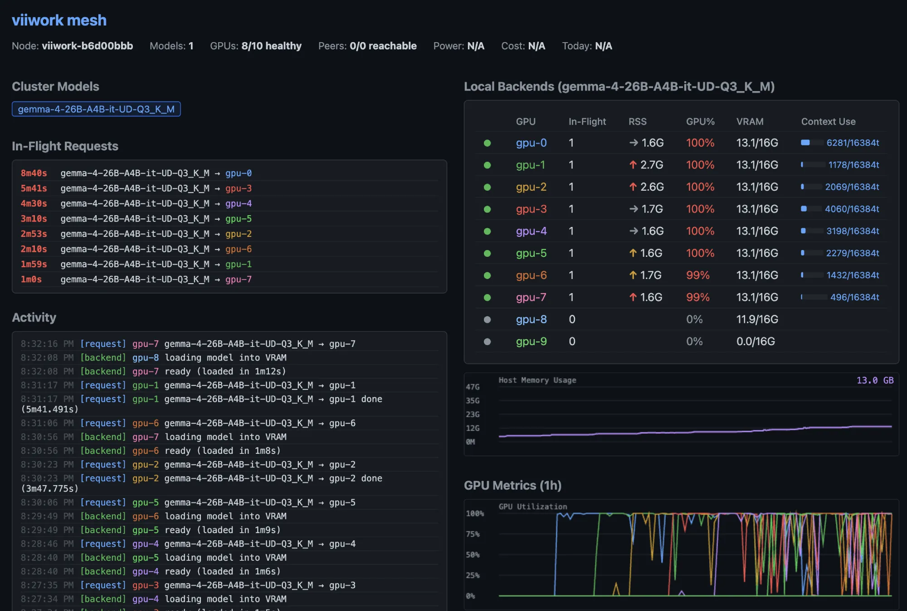

# viiwork

LLM inference load balancer for AMD Radeon VII GPUs. Runs multiple llama-server instances and exposes a single OpenAI-compatible API with adaptive load balancing. Multiple nodes can form a mesh cluster where any node is an entry point and requests route by model.



## Background

I had 50 Radeon VII cards sitting in servers in my mother-in-law's garage (who doesn't?) and wanted to do something useful with them. viiwork was born out of that — a way to turn a pile of aging-but-capable GPUs into a practical LLM inference cluster.

The Radeon VII, Instinct MI50/MI60 are all gfx906 cards with 16GB HBM2 (32GB for MI60) and a 1 TB/s memory bus — legacy hardware that punches well above its weight for LLM inference where memory bandwidth is the bottleneck. These cards are cheap secondhand and still very capable.

viiwork is designed to be useful at any scale: a single old gaming GPU on your desktop, a few Radeon Pro VII cards in a workstation, or racks of Instinct MI50s in your mother-in-law's garage. Use it standalone as an OpenAI-compatible API, or connect it to any MCP-compatible AI assistant via the built-in MCP server.

## Quick Start

```bash
# 1. Interactive setup (recommended) — detects GPUs, picks models, downloads, generates configs
./scripts/setup-node.sh

# 2. Build and run
docker compose up -d

# 3. Test
curl http://localhost:8080/v1/models
curl http://localhost:8080/v1/chat/completions \
  -H "Content-Type: application/json" \
  -d '{"model":"your-model-name","messages":[{"role":"user","content":"Hello"}]}'
```

Or manual setup:

```bash
cp viiwork.yaml.example viiwork.yaml
# Edit viiwork.yaml: set model path, GPU count, etc.
mkdir -p models
huggingface-cli download unsloth/gemma-4-26B-A4B-it-qat-GGUF \
  gemma-4-26B-A4B-it-qat-UD-Q4_K_XL.gguf --local-dir models
docker compose up -d
```

## Multi-Model Setup

Run multiple models on one host using `./scripts/setup-node.sh`. It detects GPUs, lets you assign models to GPU groups, downloads models, and generates configs with mesh peering between instances. Supports both **replica mode** (one backend per GPU, N-way concurrency) and **tensor-split mode** (one backend spanning multiple GPUs for models too large for a single card).

Example: 10 GPUs split across 3 models:
- 4 GPUs on port 8080: Gemma-4-26B-A4B-IT (replica mode, 4-way concurrency)
- 4 GPUs on port 8081: Qwen3-32B (replica mode, aggressive quant to fit 16GB)
- 2 GPUs on port 8082: Gemma-4-31B-IT (tensor-split, QAT Q4 across 2 GPUs)

All models visible from any port via mesh routing.

### "I'm Feeling Lucky" Mode

The setup script can auto-discover trending models that fit your hardware:

```bash
./scripts/setup-node.sh
# At the model prompt, enter:
#   0   — any category (surprise me)
#   0c  — coding models
#   0r  — reasoning models
#   0v  — vision/multimodal
#   0w  — writing/chat
#   0l  — multilingual
#   0a  — agentic models
```

Uses [llmfit](https://www.llmfit.org/) for hardware-aware scoring when installed, with HuggingFace API as fallback. Auto-picks a diverse assortment and assigns GPUs.

## Tensor-Split Mode

For models that don't fit in a single GPU's VRAM, tensor-split mode runs one llama-server process spanning multiple GPUs. The model's layers are distributed across GPUs, with cross-GPU traffic at layer boundaries.

```yaml
gpus:
  devices: [0, 1]
  base_port: 9001
  tensor_split:
    enabled: true
    mode: layer    # "layer" recommended; "row" is broken on the gfx906 fork
model:
  parallel: 1      # forced to 1 in tensor-split mode
```

Trade-offs vs replica mode:

| | Replica mode | Tensor-split mode |
|---|---|---|
| Concurrency | N backends = N-way parallel | 1 backend = serial requests |
| Model size cap | Must fit in 1 GPU | Can span N GPUs |
| Throughput | Higher (parallel) | Lower (serial) |
| Use case | Models ≤13GB on 16GB cards | Models >13GB that need 2+ cards |

On the gfx906 mining-rig topology (PCIe gen1 x1 risers), measured tensor-split penalty is -2 to -13% for 2-GPU and -7 to -20% for 4-GPU splits. On PCIe gen3/4/5 the penalty is smaller.

The setup script offers tensor-split models (17-20) and custom tensor-split (91) for any model. See `configs/viiwork.tensor-split.yaml.example` for all options.

## Configuration

Copy `viiwork.yaml.example` to `viiwork.yaml` and edit. Override any setting via CLI:

```bash
./viiwork --config viiwork.yaml --gpus.count 4 --model.path /models/other.gguf
```

See `viiwork.yaml.example` for all options.

### Environment Variables

| Variable | Purpose |
|----------|---------|
| `VIIWORK_DEBUG=1` | Verbose `[debug]` logging on the request path (routing decisions, per-request start/finish). Off by default — these sit on hot paths, and on a host whose cores are shared with `llama-server` writing a line per request costs CPU that inference needs. Turn it on when diagnosing routing. |
| `ENTSOE_API_KEY` | ENTSO-E API key for cost tracking (see Cost Tracking) |

## Mesh Mode

Multiple viiwork nodes form a cluster. Any node is an entry point, `/v1/models` shows all models across nodes, and requests route transparently to the correct node.

```yaml
peers:
  hosts:
    - 192.168.1.10:8080
    - 192.168.1.11:8080
  poll_interval: 10s
  timeout: 3s
```

Peers that go down are skipped and automatically re-added when they recover. Without the `peers` section, viiwork runs standalone.

## GPU Power Limits

Optionally limit power draw per Radeon VII card:

```yaml
gpus:
  count: 10
  power_limit_watts: 180  # applied via rocm-smi at startup
```

## Cost Tracking

Track real-time electricity cost per node using Nord Pool spot prices.

1. Get an API key from [ENTSO-E Transparency Platform](https://transparency.entsoe.eu/)
2. Create a `.env` file: `ENTSOE_API_KEY=your-key-here`
3. Add a `cost` section to `viiwork.yaml` (see example config)

The dashboard shows per-node cost rate (EUR/h), daily accumulated cost, and cluster totals.

## Energy History

Cost tracking answers *what is this costing right now*. The energy store answers
*where did the kilowatt-hours go* — a durable per-host, per-model history of node
draw from IPMI and per-GPU draw from `rocm-smi`, kept for a year.

It is off by default, because it needs a directory that outlives the container:

```yaml
energy:
  enabled: true
  dir: /var/lib/viiwork/energy
  sample_interval: 30s   # 2x the BMC refresh; records are always 1/minute
```

```yaml
    devices:
      - /dev/ipmi0:/dev/ipmi0
    volumes:
      - /var/lib/viiwork/energy:/var/lib/viiwork/energy
```

Disk is fixed at creation and cannot grow: about 2.6 MB for a 10-GPU host, 660 KB
for two. Three preallocated ring files per series hold a day at one-minute
resolution, a year at one hour, and a year of daily totals; retention *is* the
wrap, so there is no purge job and a restart needs no recovery.

**Enable it on exactly one viiwork instance per host.** Node wattage is a
whole-host measurement, so a multi-model host with three instances would
otherwise record the same draw three times. The recording instance covers every
GPU `rocm-smi` reports, not only its own — the attribution denominator has to
span the host — and it learns the model on a co-tenant's cards from the peer
poll, so a single recorder still produces a per-model split for the whole box.

Power is attributed marginally: each GPU is charged a share of node power in
proportion to how far it sits above its idle floor, and the baseline a host draws
just by being switched on (fans, CPU, idle cards, PSU losses) is reported
separately rather than smeared across models. Baseline plus every share equals
measured node power, so no total is invented.

Accuracy is ±15% on absolute watts. Compare models within a host freely, compare
across hosts with care, and do not present it as billing grade.

## Pipelines

Pipelines chain multiple LLM steps into virtual models. A consumer calls a virtual model name (e.g. `localize-fi` or `improve-en`) and viiwork executes a sequence of prompts across one or more real backend models.

Two pipeline types are included:

- **Localization** — translate, culturally adapt, and QC text in a single request. Supports locale aliases and per-locale glossaries.
- **Text improvement** — generate text then rewrite it to remove AI writing patterns (de-slop).

Each step specifies a model, a Go template prompt, and temperature. Steps execute sequentially, with each step's output feeding the next. Configure pipelines in `viiwork.yaml` — see the example config for both pipeline types.

## Dashboard

Available at `http://localhost:8080/`. Shows:
- Local backends table with per-GPU status, in-flight count, context usage, and RSS memory
- Live in-flight request timers with token progress, context, and RAM usage
- Activity log (newest first) with model name, completion time, and token counts
- Host memory graph
- Live GPU utilization and VRAM graphs (1 hour history, SSE updates)
- Peer mesh connectivity
- Power consumption and electricity cost

A lightweight chat UI is available at `/chat` for quick model interaction.

## Mesh Dashboard

`/mesh` is a cluster-wide view served identically by **every** node — open it on
whichever host you can reach and you see the whole mesh:

- **Mesh Models** — every model across the cluster; click one to filter the view
- **In-Flight Requests** — live jobs with elapsed time, task tag, model, and the
  backend and host serving them
- **Prompts** — the most recent requests across the mesh, newest first. Every
  row is a link to a full-page view of that request's prompt and output. See
  *Prompt and output history* below.
- **Fleet Power** — live wattage for the whole mesh: a headline total, a stacked
  graph of the last few hundred readings with one band per host, and a table
  naming each host's draw and which IPMI reading it came from. See *Fleet power*
  below.
- **Host RAM** — a strip of small per-host sparklines under the power panel, each
  scaled 0 to that host's total so the height reads as memory pressure. Hover a
  frame for the absolute figures.
- **Backends** — GPU, host, in-flight, RSS, GPU%, VRAM and context use for every
  host, grouped by model or by host. Grouped by host, each host header also
  carries that host's wattage.

**Halt** (the button in the header, or press `h`) freezes the whole view so rows
stop moving while you read or click them. Events that arrive during a halt are
queued, not dropped, and applied in order when you resume — the button shows how
many are waiting.

The page opens a single stream and never polls. Your browser only ever talks to
the host you opened; that host reaches the other nodes over your LAN, so peers do
not need to be reachable from wherever you are viewing.

Peer *jobs* appear in real time. Peer *backend counts and GPU load* refresh on
`peers.poll_interval` (10s by default) — lower it if you want the backends table
to track remote hosts more tightly.

### Fleet power

The graph needs no configuration — it is drawn from the cluster snapshots the
dashboard already receives, so it adds no polling and no extra request. A host
appears in it as soon as that host can read its own power, which means giving one
viiwork container per host access to the BMC:

```yaml
    devices:
      - /dev/ipmi0:/dev/ipmi0
```

Hosts without it are counted in the "n/m hosts reporting" line but contribute no
band, so a host that simply cannot be measured is never mistaken for a host
drawing nothing. The RAM strip below needs no BMC at all — it reads
`/proc/meminfo`, so every host appears in it.

Three things are worth knowing before reading numbers off it:

- **Wattage is per host, not per instance.** A host running several viiwork
  instances (the multi-model layout) reports the same whole-host reading from
  each of them. The view keys by hostname and counts each host once — give the
  BMC device to one container per host and the arithmetic stays obvious.
- **The window is since you opened the page**, capped at 720 readings. It is a
  live view, not history: a reload starts it over, and a halt leaves a gap
  rather than drawing a straight line across the pause. Durable per-host,
  per-model kWh is a separate feature — see *Energy History* — and this graph is
  not a substitute for it.
- **±15% on absolute watts.** Compare hosts and watch trends freely; do not bill
  anyone from it. The reading is whatever the board will answer with, and the
  table names which one each host settled on (`dcmi`, `sdr:Power Supply`,
  `sensor:<name>`).

If a host has the BMC device but still reports nothing, the probe found no
source that answers with a non-zero wattage — which is a real hardware answer,
not a bug: some boards expose the `Power Supply` sensor class as presence flags
with no watts. Startup logs name what was tried and what was adopted, and
`power.source` pins it if `auto` picks the wrong one:

```yaml
power:
  source: auto     # or dcmi | sdr | sensor:<NAME> | none
```

The RAM figures in the strip are approximate to about 1 GB — they are coarsened
before being pushed so a value that moves every second cannot flood the live
stream. `/v1/cluster` carries the exact numbers.

### Prompt and output history

Each node keeps the prompt **and the response** of its **last 1000 requests in
memory**, evicted oldest-first. Nothing is written to disk and nothing survives a
restart — this is a debugging aid, not an audit log. Prompt and output are each
truncated at 50 000 characters.

The depth is configurable:

```yaml
activity:
  prompt_history: 1000   # default
```

Memory scales with it — roughly the count times up to 100 KB, since a prompt and
an output are each capped at 50 000 characters. 1000 is therefore about 100 MB of
worst-case headroom, and realistically far less. A value below 1 falls back to
the default rather than producing a store that drops everything.

Nodes report their own capacity on `/v1/status` and `/v1/cluster`, and the mesh
dashboard sizes its list from the largest value any node reports rather than
keeping a second copy of the number. Raise the config and the view follows.

Clicking a row opens `/prompt`, a full page showing both, with the elapsed time
and a copy button for each. Rows are ordinary links, so cmd-click, middle-click
and *open in new tab* all work — the intended workflow is fanning a batch of
requests out into background tabs and reading them side by side. Each tab is
titled with its request id so they stay tellable apart.

A reasoning model's thinking is kept and labelled rather than folded into the
answer: with thinking enabled the model leaves `content` empty and puts
everything in `reasoning_content`, so discarding it would blank the output for
exactly the requests most worth reading. A failed request stores its error body,
which is usually the most useful thing on the page.

Neither prompt nor output text is carried on the activity stream; both are
fetched only when you open a request, so bodies stay off the per-request path.
The response is captured by teeing the bytes on their way to the client and
parsing once at the end, so nothing is decoded per token.
Because request ids are a per-process counter rather than a cluster-wide
namespace, a lookup is only meaningful against the node that minted the id, and
the fan-out happens server-side for the same reason the rest of the mesh view
does: your browser may not be able to reach peers directly.

Coverage includes local, peer-routed and pipeline requests. A request with no
recoverable user text (for example multimodal content parts) still gets an entry
if it produced output; a request with neither gets none rather than a blank one.

Two endpoints back this: `/v1/prompts?rid=N` reads this node's own store, and
`/v1/mesh/prompt?rid=N&addr=HOST:PORT` is what the dashboard calls — an empty
`addr` means "this node", and a non-empty one is forwarded, but **only** to an
address already in this node's configured peer list.

## Security

viiwork is designed for trusted local networks and has no built-in authentication. All API endpoints are open to any client that can reach the server. If you expose viiwork to an untrusted network, use a reverse proxy (Caddy, nginx) or firewall rules to restrict access.

Two consequences of that worth being explicit about:

- **Prompt *and response* text is readable over the API.** The history
  (`activity.prompt_history` requests per node, 1000 by default, in memory) is
  served unauthenticated like everything else.
  If either side of the traffic on your fleet is sensitive, restrict access at
  the network layer. There is currently no switch to disable the history.
- **`/v1/mesh/prompt` only forwards to configured peers.** The `addr` parameter
  is validated against this node's peer list before anything is fetched, so the
  endpoint cannot be used to make a node probe arbitrary hosts on your network.
  Peers themselves are trusted: they come from config, not from request input.

### Browser origins (CORS)

Server-side callers — curl, a backend proxying on behalf of its own UI — are
unaffected by any of this. It matters only when a page served from somewhere
else fetches viiwork directly from the browser.

Because viiwork authenticates nothing, an origin allowlist is not protecting the
API from anyone who can already reach it. What it stops is a page in some
browser on your network quietly driving your fleet through that browser's
network position. Treat the list as a real control and keep it short:

```yaml
server:
  cors:
    allow_origins: ["*.ts.net", "localhost", "127.0.0.1", "*.your-app.example"]
    allow_tailnet_ips: true   # also 100.64.0.0/10 and fd7a:115c:a1e0::/48
```

`*.example.com` matches subdomains only, never the bare apex; every other entry
must match the host exactly. `allow_origins: []` sends no CORS header at all,
which is how viiwork behaved before v1.1.0.

What ships is `*.ts.net`, `localhost` and `127.0.0.1` plus tailnet IPs — the
deployment viiwork documents, and nothing else. Your own application's origin is
deployment-specific: add it in your `viiwork.yaml`.

Where the consumer has a backend of its own, **prefer a server-side proxy over
CORS**: it needs no allowlist entry, and it can put authentication in front of
an API that has none.

## API Endpoints

| Endpoint | Method | Description |
|----------|--------|-------------|
| `/` | GET | Status dashboard (this node) |
| `/mesh` | GET | Cluster-wide dashboard (all hosts, all models) |
| `/prompt` | GET | Full-page prompt + output for one request (`?rid=N&addr=`) |
| `/chat` | GET | Lightweight chat UI |
| `/health` | GET | System health (JSON) |
| `/v1/models` | GET | List all models (local + mesh peers) |
| `/v1/chat/completions` | POST | Chat completion (routes by model) |
| `/v1/completions` | POST | Text completion (routes by model) |
| `/v1/embeddings` | POST | Embeddings (routes by model) |
| `/v1/status` | GET | Node state (JSON) |
| `/v1/cluster` | GET | Cluster state with all peers (JSON) |
| `/v1/metrics` | GET | GPU metrics history (JSON) |
| `/v1/metrics/stream` | GET | Live GPU metrics (SSE) |
| `/v1/mesh/stream` | GET | Live cluster state + activity, all hosts (SSE) |
| `/v1/prompts` | GET | Prompt + output for one request id on this node (`?rid=N`) |
| `/v1/mesh/prompt` | GET | Prompt + output lookup with server-side peer fan-out (`?rid=N&addr=`) |

All `GET`/`POST` endpoints answer CORS preflights and carry an
`Access-Control-Allow-Origin` header for allowed origins — see *Browser origins*
under [Security](#security).

Consuming this API from another application? `docs/api-integration.md` is a
worked integration spec — endpoint-by-endpoint reference, the server-side
proxy vs direct-browser trade-off, and the semantics (per-node request ids,
freshness that differs by column, no server-side job registry) that are not
visible in the payloads.

## Host Requirements

- Linux with `amdgpu` kernel driver loaded (standard on modern kernels)
- Docker with GPU device access (`/dev/kfd`, `/dev/dri`)
- No ROCm installation needed on the host
- `huggingface-cli` for model downloads (`pip install huggingface-hub`)
- Optional: `jq` for "I'm feeling lucky" model discovery
- Optional: [llmfit](https://www.llmfit.org/) for hardware-aware model recommendations

## Recommended Models

The list below is grounded in what's actually deployed on the reference fleet (10× Radeon VII) and what's been stress-tested — numbers are measured throughput, not estimated. The shape of these recommendations is driven by one hard constraint: any model whose weights + KV cache don't fit in a single 16 GB card pays a ~3× throughput tax (validated on Qwen3.5-A3B Q4_K_M vs Q3_K_M on the same GPU). For models above that line, tensor-split across 2+ GPUs avoids the tax at the cost of single-stream parallelism.

> **Build note.** Hybrid-attention models (Qwen3.5-A3B, Qwen3.6/3.8, Laguna, anything using DeltaNet / linear attention) need an upstream-current `llama.cpp` — build a fresh image from `Dockerfile`. The `viiwork:gfx906` fork is pruned to `llama / qwen2 / qwen3 / qwen3moe / gemma / gemma2 / gemma3 / gemma3n / gemma4` and will reject hybrid archs at load time. Standard transformer models run on either build.
>
> Same-week architectures can need more than "current master" — they can need an *unmerged* one. Check `general.architecture` in the GGUF before planning a bring-up: if `llama-server` answers `unknown model architecture: 'X'`, no flag will fix it and the only path is a build from whichever PR adds `X` (Qwen3.8-Flash-Next needed PR #27742 from `unslothai/llama.cpp`; master rejected it outright). Pin the PR head in a dedicated `Dockerfile.<model>-test` rather than tracking `master`, and re-pin to a release tag once it merges.

> **Quant choice on gfx906: take the highest quant that fits.** Measured on
> Qwen3.8-27B, Q6_K costs **0 tok/s** against Q4 despite reading 28% more bytes
> per token. This hardware is kernel-bound, not bandwidth-bound, and higher
> quants trade bytes for dequant ALU work — the two cancel. The usual
> "drop a quant level for speed" instinct is wrong here; drop one only to fit
> VRAM or buy context. One exception: archs whose tensor columns are not
> divisible by 256 (e.g. `nemotron_h_moe`) silently fall back to non-K types,
> where Q6_K becomes q8_0 and is pure loss — check before assuming.

> **Split mode must stay `layer`.** Measured 2026-08-15: `--split-mode row` is
> refused outright by the ROCm backend ("does not support split buffers"), and
> `--split-mode tensor` loads but runs ~9× slower on prefill while using *more*
> VRAM. Layer split runs a group's cards strictly sequentially — one card
> computes at a time — so **extra GPUs in a group buy VRAM and context, never
> throughput**. For throughput, run more backends, not wider ones.

> **Size `health.max_failures` from your cold-load time.** `llama-server`
> answers `/health` with 503 *"Loading model"* for the whole time it is reading
> tensors, so during a cold load every probe counts as a health *failure*.
> `max_failures x interval` must therefore exceed the entire load, not a typical
> restart. Measured 2026-08-27: a 104 GB model on USB loaded at ~30 MB/s (~60
> min), and a 5-minute grace made viiwork respawn the backend when it had
> already placed 78 GB of 76.9 GB of weights in VRAM — minutes from ready, and
> the restart discarded all of it. Rule of thumb:
> `model_bytes / observed_read_bytes_per_sec / interval`, then double it.

> **A single tensor larger than one card is a hard wall, not a tuning problem.**
> Layer split assigns whole *layers* to cards and `-ot` assigns a whole *tensor*
> to one device — neither can spread one oversized tensor, and `--split-mode row`
> (which would) is refused by this ROCm backend. So any model carrying a
> monolithic tensor above **16.37 GB** must keep it in host RAM here, no matter
> how many GPUs you own. When that tensor is on the per-token path the model
> becomes single-core CPU-bound and the GPUs idle. Qwen3.8-Flash-Next is the
> worked example below: a 26.82 GB n-gram embedding, unchanged across every
> published quant. Check the largest tensor before assuming VRAM total is what
> matters — total capacity is necessary, not sufficient.

> **Gemma 4 quant: prefer QAT.** Gemma 4 ships [quantization-aware-trained Q4 checkpoints](https://blog.google/innovation-and-ai/technology/developers-tools/quantization-aware-training-gemma-4/) — int4 weights at near-bf16 quality and ~3× less memory than fp16. `scripts/setup-node.sh` and `scripts/download-gemma4-31b.sh` default to these. Two gotchas, both verified on gfx906: (1) Google's own day-one GGUFs are broken (garbage detokenization / leaked special tokens) — use Unsloth's clean requants (`unsloth/gemma-4-*-it-qat-GGUF`) and a current `llama.cpp` (`viiwork:latest`, b10437+); (2) Gemma 4 is a *thinking* model — for prose/direct output, disable thinking server-side with `extra_args: ["--jinja", "--chat-template-kwargs", "{\"enable_thinking\": false}"]` (`--reasoning-budget 0` does not take on this template).

### Validated production deployments

These configs ship in `configs/` with stress-test data behind them.

**General all-rounder pick: `gpt-oss-120b` 5-pairs.** If you have 10 GPUs and want a single deploy that's both fast (≥40 tok/s single-stream) and high quality across coding, prose, translation, and reasoning, run `configs/viiwork.gptoss-120b-5pairs.yaml`. The 117B / 5.1B-active MoE is large enough to be smart and sparse enough to be quick on this hardware. Set `Reasoning: low` for snappy chat, `high` for harder problems.

| Model | Quant | Mode | Measured |
|---|---|---|---|
| **gpt-oss-120b (MoE, 5.1B active)** — *all-rounder* | MXFP4_MOE (native) | 2× TS=5 (10 GPUs) | **41 tok/s** single-stream, **73 tok/s** aggregate at conc=4 (5-min sustained, 120/120 success). Per-request decode held flat under load (40.9 → 40.3 tok/s). Latency p50/p95: 4.9 / 6.7 s single, 10.2 / 12.2 s at conc=4. Reasoning-enabled (harmony format) — set `Reasoning: low/medium/high`. |
| Gemma-4-26B-A4B-IT (MoE, 4B active) | UD-Q3_K_XL + KV-q4 | replica × 5 | **142 tok/s** aggregate at conc=10 (5.5h KV bench, 0 fail). KV-q4 vs fp16 is +9.2% throughput, -2 GB VRAM, 7/7 functional eval matches baseline. Highest aggregate throughput on this hardware. *Quant note: the QAT Q4 checkpoint (`unsloth/gemma-4-26B-A4B-it-qat-GGUF`, UD-Q4_K_XL, ~14.2 GB) is the quality-first choice but is tight for replica×5 on 16 GB — Q3_K_XL remains the measured throughput config until QAT is benched on this fleet.* |
| Qwen3.6-27B (dense hybrid) | Q4_K_M | 5× pair tensor-split (`group_size: 2`) | **76 tok/s** aggregate at conc=10 across all 10 GPUs (15-min stress, 0 fail). Single-pair single-stream: 16.9 tok/s. |
| Qwen3.8-27B (dense hybrid) — *supersedes 3.6* | Q6_K | TS=2 pair | ~15 tok/s single-stream, **the same as 3.6 at Q4** — this is a quality and VRAM upgrade, not a speed one. 1.4 GB lighter than 3.6 and ships MTP weights embedded. Context ceiling is **98304, not 131072**: MTP allocates a *second* KV cache that also scales with context, and 131072 OOMs at `common_speculative_init_result`. Prefill 176 tok/s at `-ub 512`. |
| Qwen3.5-35B-A3B (MoE hybrid, 3B active) | Q3_K_M + KV-q4 | replica per GPU | **40.7 tok/s** sustained at conc=9 (15-min stress, 0 fail). 2.8× faster than Q4_K_M because weights fit fully in VRAM. |
| Gemma-4-31B-IT (33B dense) | QAT UD-Q4_K_XL | TS=2 single backend | ~17.3 GB across 2 GPUs (down from ~21.5 GB at the old Q5_K_S, same prose quality); used as the prose generator in the localization pipeline. Run with `--jinja --chat-template-kwargs '{"enable_thinking": false}'` for direct output. See `configs/viiwork.gemma4-31b-ts2.yaml`. |
| EuroLLM-22B-Instruct-2512 | Q5_K_M | TS=2 single backend | ~16 GB across 2 GPUs; purpose-trained on 24 EU languages + Norwegian / Icelandic / Russian — the translator step in the localization pipeline. |
| Laguna-XS-2.1 (MoE, 33B / ~2.8B active) — *current gb1 deploy* | Q4_K_M | 5× TS=2 (10 GPUs) | 36.3 tok/s single-stream per backend; **113 tok/s aggregate** at conc=5. That is 3.1× single-stream, not 5× — gb1 has 4 CPU cores for 5 backends and viiwork warns about the oversubscription at startup. VRAM 14.6/13.2 GB per pair at 128K. TS=2 is mandatory: 20.3 GB does not fit one 16 GB card. |
| Laguna-S-2.1 (MoE, 118B / 8.1B active) — *evaluated, not retained* | unsloth UD-Q6_K (97.9 GB) | TS=10 (whole host) | 20.8 tok/s decode, 176 tok/s prefill. Beat its own projection on decode but **prefill is the weak side**: ~3.4 TFLOPS effective, 2.9× less FLOP-efficient per token than a dense 27B, because top-10-of-256 routing at `-ub 512` leaves each expert ~20 tokens of work. A cold 256K fill costs ~72 min, so the advertised context is real in VRAM and unaffordable in wall-clock. Replaced by the XS fleet above after use. |
| Granite-4.1-8B | Q4_K_M | single-GPU replica × N | ~5 GB weights, generous KV headroom for 16k context. Run with `-fa on`. IBM's enterprise/utility model — strong instruction following, function/tool calling, RAG / structured-output workflows, multilingual; well-suited to back-office automation, doc Q&A, and embedding into agentic loops where you want a small, predictable, English-leaning helper next to a heavier reasoning model on the mesh. |

### Bring-ups in progress

Not production rows yet — recorded so the next attempt does not rediscover the
same walls.

| Model | State | What is known |
|---|---|---|
| Soofi-S-30B-A3B (hybrid Mamba-2 / MoE) | **Blocked** on HuggingFace manual approval | Configs written and validated (`configs/viiwork.soofi-s-30b-ts2-gpu01.yaml`). The GGUF declares `general.architecture = nemotron_h_moe`, **not** "soofi" — it reuses an existing arch, so no llama.cpp bump is needed; do not grep binaries for "soofi". Quant choice inverts the rule above: columns (2688/1856/3712) are not divisible by 256, so every K-quant falls back — Q6_K becomes q8_0 (~32 GB, no quality gain) and Q5_K_M becomes q5_1 (~25 GB, the pick). No community requant exists to route around the gate, and self-converting is blocked because the base repo is gated too. |
| Qwen3.8-Flash-Next (125B total / 6B active, GDN + QSA hybrid) | **Runs, but loses to the 27B** — not retained | Loads and serves correctly across all 10 GPUs, and is *slower than Qwen3.8-27B on two*: 8.7 / 16.0 / 20.4 tok/s at conc 1 / 2 / 4 against the 27B's 10.2 / 18.6 / 27.0. The cause is structural, not tuning. `general.architecture = qwen4exp`, which upstream master rejects outright (`unknown model architecture`); support is only in the still-open PR #27742 from `unslothai/llama.cpp` (branch `qwen4exp/qwen3.8-flash-next`). The blocker is `per_layer_token_embd.weight`: **26.82 GB as one indivisible IQ4_NL tensor** (51.2B elements — the n-gram table). A Radeon VII holds 16.37 GB and `-ot` assigns a whole tensor to one device, so it can never be GPU-resident here and stays in host RAM. Decode is then pinned to a **single CPU core** (measured 0.91 of 4 cores busy with GPUs at 0%), which is the real ceiling: 48.5/160 GB VRAM is in use while 30.9 GB sits in RSS. Needs cards ≥27 GB to be worth revisiting. Re-tested at UD-Q4_K_XL (103.7 GB) to rule out the quant: decode was **unchanged at 12.6 tok/s**, confirming the ceiling is CPU, not quantization — on gfx906 the higher quant rides free. Quality at Q4_K_XL was *better* than the 27B on Finnish (correct terminology throughout vs four terminology errors and a case error) and equal on strict-JSON extraction, and it was more token-efficient (5 of 8 eval prompts completed in budget vs the 27B's 2 of 8). But **neither model solves hard reasoning through this stack**: on one bridge-crossing problem the 27B burned 6,000 tokens / 6.4 min and Flash-Next 10,000 tokens / 17.1 min, both still mid-deliberation, and Flash-Next's decode degraded 12.6 -> 9.7 tok/s as context grew (QSA attention cost). Both emit raw chain-of-thought into `content` with no `<think>` delimiters, which looks like a template/integration gap rather than a reasoning limit — worth retrying under vLLM/SGLang before concluding anything about the models. Verdict: not retained; the 27B gives comparable quality at 1.6x the speed on 2 GPUs instead of 10. |
| Muse-Glimmer-30B (meta-models) | Ran on GPUs 4+7, since displaced | Needs llama.cpp **b10369+** (`muse_glimmer` landed in PR #26841); the older b9222 pin could not load it and `Dockerfile.gfx906` is arch-pruned. kquant-dynamic is 19.65 GB so TS=2 is required, not preferred. Output needs `reasoning_strength: low` — at the template default the model self-talks and that text leaks into `content`. `--mmproj` and the DFlash drafter are deliberately not wired in (upstream #26873, #26894). |

### Single-GPU picks (≤16 GB)

For lightweight / multi-replica setups. Q3_K_M is the practical ceiling on a Radeon VII for the 30B class — anything heavier triggers the VRAM-fit tax.

| Model | Quant | Approx VRAM | Notes |
|---|---|---|---|
| Gemma-4-26B-A4B-IT | QAT UD-Q4_K_XL | ~14.2 GB | Best general-purpose pick on 16 GB; QAT Q4 = near-bf16 quality. Tight on a single card — run with KV-q4 + short context (`-fa on --cache-type-k q4_0 --cache-type-v q4_0`). For replica×N throughput or more KV headroom, drop to non-QAT UD-Q3_K_XL (~12.5 GB). |
| Gemma-4-E4B-IT | QAT UD-Q4_K_XL | ~4.2 GB | 8B multimodal; QAT Q4 = near-bf16 quality at half the VRAM of the old Q8_0 (~8.2 GB). |
| Granite-4.1-8B | Q4_K_M | ~5 GB | Strong instruction following, tool calling, RAG / structured-output workflows. Use as a fast utility model alongside a heavier reasoner. |

### Tensor-split picks (multi-GPU)

For models above the single-GPU ceiling. Layer-mode tensor split costs roughly 2-13% per extra GPU on the reference fleet's PCIe-gen1-x1 mining-rig topology (measured on the gfx906 fork 6h stress). On modern PCIe gen3/4/5 the penalty is smaller.

| Model | Quant | Min GPUs | Why tensor-split |
|---|---|---|---|
| Gemma-4-31B-IT | QAT UD-Q4_K_XL | 2 | 33B dense at near-bf16 QAT Q4 (~17.3 GB); higher prose quality than the 26B MoE. |
| EuroLLM-22B | Q5_K_M | 2 | 22B dense translator; doesn't fit comfortably at Q5 on one card. |
| Qwen3.6-27B | Q4_K_M | 2 (per pair, scale with `group_size`) | Hybrid dense at single-stream tensor-parallel speed; 5-pair layout gives both per-request latency and aggregate throughput. |
| Laguna-XS-2.1 | Q4_K_M | 2 (per pair, scale with `group_size: 2`) | 20.3 GB will not fit a 16 GB card, so TS=2 is the floor rather than a tuning choice. Five pairs is the throughput layout on a 10-GPU node. |
| gpt-oss-120b | MXFP4_MOE | 5 (per group, scale with `group_size: 5`) | 117B / 5.1B-active MoE; the all-rounder pick on a 10-GPU node — see the validated row above for measured throughput. |

> Other 30-32B models (Qwen3-32B, DeepSeek-R1-Distill, Qwen2.5-Coder, etc.) load on this hardware but aren't currently part of the reference fleet — drop them into `configs/` and run `scripts/bench-sustained.sh` to add measured numbers.

## Builds

viiwork ships in two parallel builds in this same repo. They share the Go server, balancer, dashboard, and API — they differ only in the llama.cpp binary the server spawns.

| | Stable foundation | Experimental track |
|---|---|---|
| Image | `viiwork:latest` | `viiwork:gfx906` |
| Dockerfile | `Dockerfile` | `Dockerfile.gfx906` |
| Make target | `make docker` (alias `make docker-stable`) | `make docker-gfx906` (alias `make docker-experimental`) |
| llama.cpp | Pinned upstream `ggml-org/llama.cpp` release | Local `llama.cpp-gfx906` fork tree (stripped, gfx906-specialized) |
| Status | Default. Production-stable, runs everywhere. | Bake-in track, opt-in per node. +3.0% sustained tok/s vs upstream and identical memory profile in the 4 h A/B soak (`milestone/gfx906-fork-4h-soak-2026-04-09`). |

`scripts/setup-node.sh` asks which build to use as its very first prompt — option 1 (stable) is the default. To switch a running node between tracks in place without re-running setup, use `scripts/switch-node-build.sh`.

See **[BUILDS.md](BUILDS.md)** for the full comparison, when to use which, image distribution between nodes, rollback procedure, and the specific design rationale for the experimental track.

## Docker Build

Both builds pin llama.cpp to a specific release tag and patch the HIP FP8 header for gfx906 compatibility. To bump the upstream version on the stable build:

```bash
docker compose build --build-arg LLAMA_CPP_VERSION=b8700
```

The experimental build is pinned to a specific commit on the `llama.cpp-gfx906` fork — bump it by updating the fork tree at `$GFX906_FORK` (default `~/gfx906-work/llama.cpp-gfx906`) and re-running `make docker-gfx906`.

The FP8 patch is required because ROCm 6.2+ includes `<hip/hip_fp8.h>` for all architectures, but gfx906 has no FP8 hardware and the header fails to compile.

## Scripts

| Script | Description |
|--------|-------------|
| `scripts/setup-node.sh` | Interactive setup: pick build (stable/experimental), detect GPUs, select models (replica or tensor-split), download, generate configs, optionally run the power/perf benchmark |
| `scripts/switch-node-build.sh` | Flip a running node between the stable foundation and the experimental gfx906 track in place |
| `scripts/power-perf-sweep.sh` | Sweep one GPU through power-cap settings (150/180/210/250W), measure tok/s + watts + temperature, recommend the best `power_limit_watts`. ~15-20 min, power-cap-only, fully reversible |
| `scripts/power-perf-sweep-phase2.sh` | Advanced sweep: voltage curve + memory clock tuning. Riskier than Phase 1 — requires explicit user go-ahead. Has correctness gate (compares outputs against baseline) |
| `scripts/setup-opencode.sh` | Configure OpenCode client with auto-detected models |
| `scripts/update.sh` | Pull latest, rebuild Docker image, restart |
| `scripts/rebuild.sh` | Full clean rebuild: stop, remove images, rebuild, start |
| `scripts/bench.sh` | Stress benchmark: ramp concurrency from 1 to N, measure throughput and latency |
| `scripts/bench-sustained.sh` | Sustained load benchmark: hold N concurrent requests for a duration |

## MCP Server

`viiwork-mcp` is an MCP server that exposes the viiwork cluster as tools for any MCP-compatible AI assistant. This lets AI coding tools delegate inference to your locally hosted models.

### Build

```bash
make mcp    # builds bin/viiwork-mcp
```

### Tools

| Tool | Description |
|------|-------------|
| `query` | Send a prompt to a local model. Params: `prompt` (required), `system`, `model`, `max_tokens`, `temperature` |
| `models` | List available models on the cluster |
| `status` | Get cluster health, per-GPU backend status, in-flight counts |

### Configuration

The MCP server connects to a viiwork instance via `--url` flag or `VIIWORK_URL` environment variable:

```bash
viiwork-mcp --url http://your-viiwork-host:8080
```

Add it to your MCP client's configuration as a stdio transport server pointing at the `viiwork-mcp` binary.

## Development

```bash
make build         # build binary (with git version embedded)
make mcp           # build MCP server
make test          # run unit tests
make docker        # build stable Docker image (viiwork:latest)
make docker-gfx906 # build experimental Docker image (viiwork:gfx906)
make up            # docker compose up -d
make down          # docker compose down

go test -v -tags=integration  # integration tests (mock backends, no GPU needed)
go test -v -run TestName ./internal/package  # single test
go test -bench=. -benchmem ./internal/proxy ./internal/balancer  # hot-path benchmarks
```

Requires Go 1.27.0 (pinned in `go.mod` and the Dockerfiles). The only module
dependency is `gopkg.in/yaml.v3`; everything else is stdlib, deliberately.

The benchmarks cover the per-token and per-request paths — SSE response
rewriting, request body parsing, and route picking. Compare **allocation
counts** rather than wall-clock when judging a change: timings taken on a host
that is also serving models are extremely noisy, while alloc counts are
deterministic.
