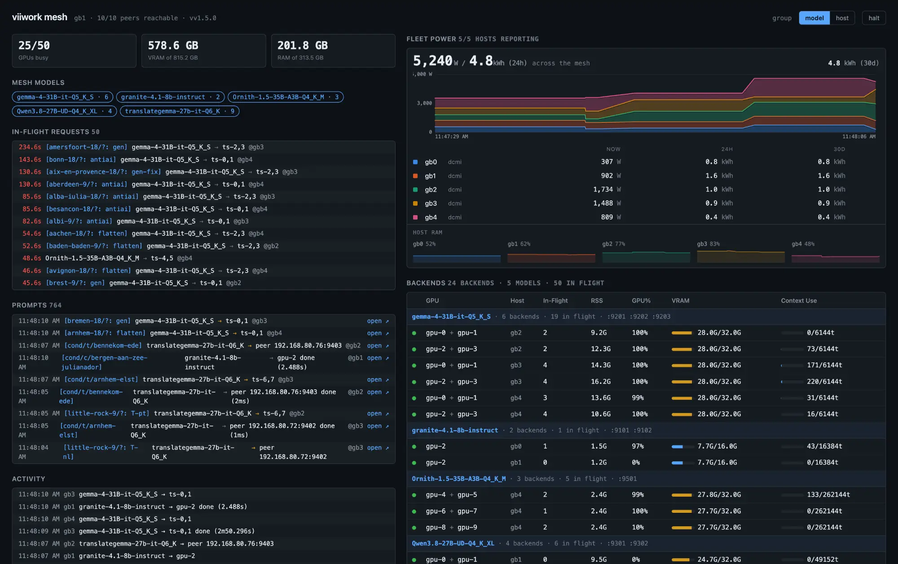

# viiwork

LLM inference for a fleet of machines, built originally for AMD Radeon VII GPUs. One viiwork node per machine runs all of that machine's models (llama-server processes pinned to their GPUs) behind one OpenAI-compatible API. Nodes find each other and form a mesh on their own: any node is an entry point, and a request goes to a free slot wherever one exists.

## viiwork 2.0 is a breaking release

**A v1 fleet cannot be upgraded one machine at a time.** The mesh protocol
changed: v2 nodes gossip their membership on port 7946 instead of polling a
written list of peers over HTTP, so **a v1 node and a v2 node never see each
other**. Convert a mesh together, or run the two as separate meshes until the
last machine is across.

The rest, roughly in the order you meet it:

- **The config is a different file, and a v1 one is refused at startup** rather
  than guessed at. One file per machine, listing every model on it, replaces
  one instance file per model.
- **One process per machine, and two fixed ports on every machine**: 8086 for
  the API and every dashboard, 7946 for gossip. Per-model ports and
  `server.mesh_port` are gone.
- **`models[].context` is the context of one slot.** v1's `model.context_size`
  was llama.cpp's total, divided across slots — carrying the old number over
  multiplies VRAM use by `parallel`.
- **The Go module path is `github.com/janit/viiwork/v2`**, and `meshapi`'s wire
  types moved with the protocol. Importers pin the major version.
- **Gone:** `peers` (discovery is automatic), `balancer` (routing follows free
  slots), and `--section.key` command-line overrides — the config file is the
  only input.

[docs/migrating-to-v2.md](docs/migrating-to-v2.md) maps every key, works a real
machine through the change and covers rollback; `viiwork-accept config`
validates the new file while v1 is still serving. viiwork 1.x remains at tag
[`v1.8.1`](https://github.com/janit/viiwork/releases/tag/v1.8.1).



## Background

I had 50 Radeon VII cards sitting in servers in my mother-in-law's garage (who doesn't?) and wanted to do something useful with them. viiwork was born out of that — a way to turn a pile of aging-but-capable GPUs into a practical LLM inference cluster.

The Radeon VII, Instinct MI50/MI60 are all gfx906 cards with 16GB HBM2 (32GB for MI60) and a 1 TB/s memory bus — legacy hardware that punches well above its weight for LLM inference where memory bandwidth is the bottleneck. These cards are cheap secondhand and still very capable.

viiwork is designed to be useful at any scale: a single old gaming GPU on your desktop, a few Radeon Pro VII cards in a workstation, or racks of Instinct MI50s in your mother-in-law's garage. Use it standalone as an OpenAI-compatible API, or connect it to any MCP-compatible AI assistant via the built-in MCP server.

## Quick Start

```bash
# 1. Write the machine's config
cp viiwork.yaml.example viiwork.yaml
# Edit viiwork.yaml: one entry under models: per model, with its GPUs.

# 2. Choose the mesh mode: a shared secret, or mesh.open: true in viiwork.yaml
sudo install -d /etc/viiwork && sudo install -m 0640 /dev/null /etc/viiwork/mesh.env
echo "VIIWORK_MESH_SECRET=$(openssl rand -base64 32)" | sudo tee /etc/viiwork/mesh.env >/dev/null

# 3. Build and run
make docker
cp configs/docker-compose.v2.example.yaml docker-compose.yaml
docker compose up -d

# 4. Test
curl http://localhost:8086/v1/models
curl http://localhost:8086/v1/chat/completions \
  -H "Content-Type: application/json" \
  -d '{"model":"Qwen3.8-27B","messages":[{"role":"user","content":"Hello"}]}'
```

Every machine runs the same image with its own `viiwork.yaml`. The API and every
dashboard are on port 8086, and membership gossip is on 7946 (tcp and udp), on
every machine. Coming from viiwork 1.x, converting a host and acceptance: see
[docs/migrating-to-v2.md](docs/migrating-to-v2.md).

## Multi-Model Setup

A machine's models are entries under `models:` in its one config file. Each has
an explicit `name` (the model id clients send), its host GPU indices, and its
slots:

```yaml
models:
  - name: Qwen3.8-27B
    engine: llamacpp
    path: /models/Qwen3.8-27B-UD-Q4_K_XL.gguf
    gpus: [0, 1]
    gpus_per_backend: 2      # one backend across both cards
    context: 49152           # tokens PER SLOT
    parallel: 2
  - name: granite-4.1-8b
    engine: llamacpp
    path: /models/granite-4.1-8b-Q4_K_M.gguf
    gpus: [2, 3, 4, 5]       # gpus_per_backend defaults to 1: four replicas
    context: 16384
    parallel: 2
```

A GPU belongs to at most one model. Every model on every machine is visible from
any node, and `SIGHUP` (`docker kill -s HUP viiwork`) applies an edited model
list: added models start, removed ones drain and stop, and a changed entry
restarts that model only.

There is no interactive setup script: `scripts/setup-node.sh` wrote **viiwork
1.x** instance configs, which a viiwork 2 node refuses, and it was removed in
v2.1.0 rather than left as a trap. Write the machine's file from
`viiwork.yaml.example` and check it with `viiwork-accept config`;
[docs/migrating-to-v2.md](docs/migrating-to-v2.md) converts existing 1.x
instances.

## Tensor-Split Mode

For models that don't fit in a single GPU's VRAM, one llama-server backend spans
several GPUs. Set `gpus_per_backend` to the group size: a model's `gpus` are cut
into groups of that size, one backend per group.

```yaml
models:
  - name: gpt-oss-120b
    engine: llamacpp
    path: /models/gpt-oss-120b-MXFP4_MOE.gguf
    gpus: [0, 1, 2, 3, 4, 5, 6, 7, 8, 9]
    gpus_per_backend: 5      # two backends of five cards each
    context: 32768
    parallel: 2
    llamacpp:
      split_mode: layer      # "layer" is the only mode that works on gfx906
```

Trade-offs vs one backend per GPU:

| | Replicas (`gpus_per_backend: 1`) | Split groups (`gpus_per_backend: N`) |
|---|---|---|
| Concurrency | N backends, each with `parallel` slots | one backend per group |
| Model size cap | Must fit in 1 GPU | Can span N GPUs |
| Throughput | Higher (parallel) | Lower (a group computes one card at a time) |
| Use case | Models ≤13GB on 16GB cards | Models >13GB that need 2+ cards |

On the gfx906 mining-rig topology (PCIe gen1 x1 risers), measured tensor-split penalty is -2 to -13% for 2-GPU and -7 to -20% for 4-GPU splits. On PCIe gen3/4/5 the penalty is smaller.

## Configuration

Copy `viiwork.yaml.example` to `viiwork.yaml` and edit it. The file is the only
input: `viiwork --config /etc/viiwork/viiwork.yaml` (the default path), and
there are no command-line overrides. The node validates the whole file at
startup and on every reload, and names the offending field when something is
wrong. A viiwork 1.x file is refused with a pointer to
[docs/migrating-to-v2.md](docs/migrating-to-v2.md).

`models[].context` is the context of **one slot**, for every engine: llama.cpp
is started with `--ctx-size context × parallel`.

### Environment Variables

| Variable | Purpose |
|----------|---------|
| `VIIWORK_MESH_SECRET` | Mesh secret, base64 of exactly 32 bytes (`openssl rand -base64 32`). Unset requires `mesh.open: true`. See Mesh Mode |
| `VIIWORK_MESH_SECRET_PREV` | The previous secret, while rotating |
| `VIIWORK_DEBUG=1` | Verbose `[debug]` logging on the request path. Off by default — these sit on hot paths, and on a host whose cores are shared with `llama-server` writing a line per request costs CPU that inference needs. Turn it on when diagnosing routing. |
| `ENTSOE_API_KEY` | ENTSO-E API key for cost tracking (see Cost Tracking) |
| `BMC_PASSWORD` | BMC password for out-of-band power control (see Power control) |

## Mesh Mode

Nodes form one mesh without peer lists. Switch a machine on and its models are
usable from every node within seconds; switch it off and routing stops sending
to it first, while membership follows.

```yaml
mesh:
  network: tailnet     # tailnet (default) | lan
  seeds: []            # optional "ip:7946" of any member
```

- **`tailnet`:** a node advertises its Tailscale address and finds the other
  online machines through tailscaled's local API
  (`/var/run/tailscale/tailscaled.sock`). Offline devices are never dialled.
- **`lan`:** a node advertises the address of its default-route interface and
  finds others with mDNS (`_viiwork._tcp`).
- **`seeds`:** addresses to join where discovery cannot reach.

Discovery repeats every `mesh.rejoin_interval` (60 s), which is also how a
healed network split merges back. Gossip binds the advertise address only, never
`0.0.0.0`. Machines must reach each other on 7946 tcp+udp and 8086 tcp.

### Secured and open

- **Secured:** set `VIIWORK_MESH_SECRET` on every machine. Gossip is encrypted
  and authenticated, a node without the secret cannot join, forwards between
  nodes are signed, and alias writes need a signature.
- **Open:** leave it unset and set `mesh.open: true`. Gossip is plaintext and
  any viiwork node that can reach 7946 joins. Alias writes are accepted only
  from the node's own machine.

A node with neither refuses to start and names the variable it looked for; a
node started in the wrong mode logs `mesh mode mismatch` and stays out. An open
mesh gains a secret without downtime in three fleet-wide steps
(`mesh.secret_enforce: none`, `outgoing`, `full`), described in the
[migration guide](docs/migrating-to-v2.md#5-mesh-mode).

### Routing

A request for a model goes to a local backend with a free slot, else to the
member with the most free slots (every member publishes its slots on
`/v1/capacity`, polled once a second), else it waits in a FIFO queue on the node
that received it for up to `routing.queue_timeout` (20 s), then gets 429 with
`Retry-After: 2`. A forward refused before its first byte is retried on another
route; a node that receives a forward admits it only into a free slot, so
requests never bounce between nodes. `?host=<node name>` pins a request to one
machine.

## Aliases

An alias is a stable, mesh-wide name for a real model: point clients at
`stable-coder`, and switch which model it means once, from any machine.

```bash
viiwork alias set stable-coder Qwen3.8-27B --fallback granite-4.1-8b
viiwork alias ls
viiwork alias history stable-coder
viiwork alias revert stable-coder      # swap back to the previous version
viiwork alias rm stable-coder
viiwork alias export > aliases.json    # an off-fleet copy
viiwork alias import aliases.json
```

`set`, `rm` and `revert` report how many members have the change
(`stable-coder -> Qwen3.8-27B (ver 6): 9/9 alive members`); a count below the
member total shows a lagging node or a split network. The CLI talks to the node
on the same machine (`--node host:port` for another) and, in a secured mesh,
signs with the secret named by `mesh.secret_env`.

An alias resolves on the node that receives the request: to its target when any
member serves it, else to the first served fallback, else 503 with
`Retry-After: 5`. A target that is served but full queues rather than falling
back. Responses carry `X-Viiwork-Alias` and `X-Viiwork-Model`. A real model
always wins over an alias of the same name, and `/mesh` shows every alias's
state. Every node keeps the table in `node.state_dir`, so a machine that was off
serves its last table and catches up on its first sync.

## GPU Power Limits

Optionally limit power draw per Radeon VII card:

```yaml
gpu:
  power_limit_watts: 180  # applied via rocm-smi when a backend starts
```

## Cost Tracking

Track real-time electricity cost per node using Nord Pool spot prices.

1. Get an API key from [ENTSO-E Transparency Platform](https://transparency.entsoe.eu/)
2. Put `ENTSOE_API_KEY=your-key-here` in the node's environment:
   `/etc/viiwork/mesh.env` with the compose example or the systemd unit, or a
   `.env` file in the directory the node runs from
3. Add a `cost` section to `viiwork.yaml` (see example config)

The dashboard shows per-node cost rate (EUR/h), daily accumulated cost, and cluster totals.

## Energy History

Cost tracking answers *what is this costing right now*. The energy store answers
*where did the kilowatt-hours go* — a durable per-host, per-model history of node
draw from IPMI and per-GPU draw from `rocm-smi`, kept for a year.

It is off by default, because it needs a directory that outlives the container:

```yaml
energy:
  enabled: true
  dir: /var/lib/viiwork/energy
  sample_interval: 30s   # 2x the BMC refresh; records are always 1/minute
```

```yaml
    devices:
      - /dev/ipmi0:/dev/ipmi0
    volumes:
      - /var/lib/viiwork/energy:/var/lib/viiwork/energy
```

Disk is fixed at creation and cannot grow: about 2.6 MB for a 10-GPU host, 660 KB
for two. Three preallocated ring files per series hold a day at one-minute
resolution, a year at one hour, and a year of daily totals; retention *is* the
wrap, so there is no purge job and a restart needs no recovery.

The node covers every GPU the machine reports, and takes each card's model from
its own `models[].gpus`, so one recorder produces a per-model split for the whole
box. On a machine with no BMC, node power is the sum of GPU board power (labelled
`rocm-smi` or `nvidia-smi`) and every watt is attributed to the cards directly.

Power is attributed marginally: each GPU is charged a share of node power in
proportion to how far it sits above its idle floor, and the baseline a host draws
just by being switched on (fans, CPU, idle cards, PSU losses) is reported
separately rather than smeared across models. Baseline plus every share equals
measured node power, so no total is invented.

Accuracy is ±15% on absolute watts. Compare models within a host freely, compare
across hosts with care, and do not present it as billing grade.

## Pipelines

Pipelines chain multiple LLM steps into virtual models. A consumer calls a virtual model name (e.g. `localize-fi` or `improve-en`) and viiwork executes a sequence of prompts across one or more real backend models.

Two pipeline types are included:

- **Localization** — translate, culturally adapt, and QC text in a single request. Supports locale aliases and per-locale glossaries.
- **Text improvement** — generate text then rewrite it to remove AI writing patterns (de-slop).

Each step specifies a model, a Go template prompt, and temperature. Steps execute sequentially, with each step's output feeding the next. Configure pipelines in `viiwork.yaml` — see the example config for both pipeline types.

## Dashboard

Available at `http://<machine>:8086/`, for that node:
- One table per model — engine, busy slots and queue — with a row per backend:
  GPUs, status and phase, busy slots, RSS, GPU utilisation, VRAM, decode
  progress and respawns
- A fleet line: members alive, mesh models, fleet power and cost
- Live in-flight request timers and the activity log (newest first)
- Host memory graph, live GPU utilization and VRAM graphs (1 hour history, SSE
  updates), power consumption and electricity cost

A lightweight chat UI is available at `/chat` for quick model interaction. It is
addressable — `/chat?model=<id>` preselects a model and `&host=<node>` pins it to
one machine — and `/mesh` links into it with one **Open Chat** entry per model.
Aliases are listed after the real models. The **backend** selector lists every
machine currently serving the chosen model; `mesh` (the default) routes as
always, and each reply names the node that ran it and the node that forwarded
it there.

## Mesh Dashboard

**`http://<any-machine>:8086/mesh`** — the same view from every node.

The cluster view is served identically by every node, so any machine you can
reach shows you the whole mesh.

What it shows:

- **Mesh Models** — every model across the cluster; click one to filter the view
- **Aliases** — every alias with its target, fallbacks, what it resolves to now
  and its state; `shadowed` and `unavailable` are highlighted
- **In-Flight Requests** — live jobs with elapsed time, task tag, model, and the
  backend and host serving them
- **Prompts** — the most recent requests across the mesh, newest first. Every
  row is a link to a full-page view of that request's prompt and output. See
  *Prompt and output history* below.
- **Fleet totals** — GPUs busy, VRAM and host RAM across the whole mesh, as
  three plain readings at the top of the page
- **Fleet Power** — live wattage and the last 24 hours' energy for the whole
  mesh (`1,751 W / 12.4 kWh (24h)`), with the 30-day total at the far right,
  then all three per host. The kWh half
  needs the energy store enabled — see *Energy History* — and the header says how many hosts it
  covers when that is fewer than are reporting power. Live wattage for the mesh: a headline total, a stacked
  graph of the last few hundred readings with one band per host, and a table
  naming each host's draw and which IPMI reading it came from. See *Fleet power*
  below.
- **Host RAM** — a strip of small per-host sparklines under the power panel, each
  scaled 0 to that host's total so the height reads as memory pressure. Hover a
  frame for the absolute figures.
- **Backends** — backend id, GPUs, host, busy slots, RSS, GPU%, VRAM and decode
  progress for every machine, grouped by model or by host. Grouped by host, each
  host header also carries that host's wattage. Members that are not alive stay
  listed, greyed, with their state.

Hosts are listed by name throughout — the power rows, the stacked bands and the
RAM strip all read node-a, node-b, node-c… rather than reordering themselves as load
shifts.

In-flight requests are reconstructed by your browser from the event stream,
because no endpoint returns "what is running now". The stream replays its recent
history when it connects, so opening the page mid-flight shows the jobs already
running, and a laptop coming back from sleep gets the completions it missed
instead of leaving rows counting up in red forever. A gap longer than the node's
event ring is not recoverable: the view then shows fewer requests than are
really running rather than phantom ones, and the Backends table's in-flight
counts stay correct either way.

**Halt** (the button in the header, or press `h`) freezes the whole view so rows
stop moving while you read or click them. Events that arrive during a halt are
queued, not dropped, and applied in order when you resume — the button shows how
many are waiting.

The page opens a single stream and never polls. Your browser only ever talks to
the node you opened; that node reaches the other members itself, so they do not
need to be reachable from wherever you are viewing.

Other members' *jobs* appear in real time. Their *backend counts and GPU load*
refresh every 5 seconds, from each member's `/v1/status`.

### Fleet power

The graph needs no configuration — it is drawn from the cluster snapshots the
dashboard already receives, so it adds no polling and no extra request. A machine
appears in it as soon as it can read its own power: from the BMC when the node
has access to it, else from the sum of its GPUs' board power.

```yaml
    devices:
      - /dev/ipmi0:/dev/ipmi0
```

Hosts without it are counted in the "n/m hosts reporting" line but contribute no
band, so a host that simply cannot be measured is never mistaken for a host
drawing nothing. The RAM strip below needs no BMC at all — it reads
`/proc/meminfo`, so every host appears in it.

Three things are worth knowing before reading numbers off it:

- **Wattage is per machine.** A BMC reading covers the whole chassis; a GPU sum
  covers only the cards. The table names which one each machine reports.
- **The window is since you opened the page**, capped at 720 readings. It is a
  live view, not history: a reload starts it over, and a halt leaves a gap
  rather than drawing a straight line across the pause. Durable per-host,
  per-model kWh is a separate feature — see *Energy History* — and this graph is
  not a substitute for it.
- **±15% on absolute watts.** Compare hosts and watch trends freely; do not bill
  anyone from it. The reading is whatever the board will answer with, and the
  table names which one each host settled on (`dcmi`, `sdr`, `sensor:<name>`,
  or `rocm-smi`/`nvidia-smi` for a GPU sum).

If a host has the BMC device but still reports nothing, the probe found no
source that answers with a non-zero wattage — which is a real hardware answer,
not a bug: some boards expose the `Power Supply` sensor class as presence flags
with no watts. Startup logs name what was tried and what was adopted, and
`power.source` pins it if `auto` picks the wrong one:

```yaml
power:
  source: auto     # or dcmi | sdr | sensor:<NAME> | none
```

The RAM figures in the strip are approximate to about 1 GB — they are coarsened
before being pushed so a value that moves every second cannot flood the live
stream. `/v1/cluster` carries the exact numbers.

### Power control

Each host in the Fleet Power table can carry a power button. It is **off by
default** and there is no wildcard — only hosts you name can be targeted:

```yaml
power:
  control:
    enabled: true
    hosts: [node-a, node-b, node-c]
```

Hosts are node names. That much works immediately for hosts that are
**running**: the node on a machine controls it in-band through `/dev/ipmi0`, with
no credentials, and a request is forwarded to the member of that name.

A host that is **powered off** has no node to ask, so its BMC has to be reached
over the network. That needs credentials, and without them a host can be
switched off but not back on — the dashboard shows a disabled button saying so
rather than one that fails:

```yaml
    bmc:
      username: admin
      password_env: BMC_PASSWORD    # set in .env, not in the config file
      addresses:
        node-a: 192.0.2.65          # optional; see below
```

Addresses are optional per host. A node discovers its own BMC address in-band
and shares it, so a host seen online at least once needs no entry — which also
means a learned address cannot go stale the way a written one does when BMCs
are on DHCP.

Three things guard it, and none of them is authentication — viiwork has none,
and this does not add any:

- **The allowlist.** A host you did not name cannot be targeted, by the UI or
  by curl.
- **A node will not power off its own host.** Doing so would destroy the answer
  to the request and the dashboard asking it. Its button is disabled, and the
  server refuses it too — open another node's `/mesh` to control that host.
- **A confirmation prompt** naming the host and the action.

Anyone who can reach the API can use it. That is the same trust model as the
rest of viiwork, but the consequence is larger, so keep the allowlist to the
hosts you actually want reachable this way.

### Prompt and output history

Each node keeps the prompt **and the response** of its **last 1000 requests in
memory**, evicted oldest-first. Nothing is written to disk and nothing survives a
restart — this is a debugging aid, not an audit log. Prompt and output are each
truncated at 50 000 characters.

The depth is configurable:

```yaml
activity:
  prompt_history: 1000   # default
```

Memory scales with it — roughly the count times up to 100 KB, since a prompt and
an output are each capped at 50 000 characters. 1000 is therefore about 100 MB of
worst-case headroom, and realistically far less. A value below 1 falls back to
the default rather than producing a store that drops everything.

Nodes report their own capacity on `/v1/status` and `/v1/cluster`, and the mesh
dashboard sizes its list from the largest value any node reports rather than
keeping a second copy of the number. Raise the config and the view follows.

Clicking a row opens `/prompt`, a full page showing both, with the elapsed time
and a copy button for each. Rows are ordinary links, so cmd-click, middle-click
and *open in new tab* all work — the intended workflow is fanning a batch of
requests out into background tabs and reading them side by side. Each tab is
titled with its request id so they stay tellable apart.

A reasoning model's thinking is kept and labelled rather than folded into the
answer: with thinking enabled the model leaves `content` empty and puts
everything in `reasoning_content`, so discarding it would blank the output for
exactly the requests most worth reading. A failed request stores its error body,
which is usually the most useful thing on the page.

Neither prompt nor output text is carried on the activity stream; both are
fetched only when you open a request, so bodies stay off the per-request path.
The response is captured by teeing the bytes on their way to the client and
parsing once at the end, so nothing is decoded per token.
Because request ids are a per-process counter rather than a cluster-wide
namespace, a lookup is only meaningful against the node that minted the id, and
the fan-out happens server-side for the same reason the rest of the mesh view
does: your browser may not be able to reach peers directly.

Coverage includes local, forwarded and pipeline requests. The history lives on
the node that received the request from the client. A request with no
recoverable user text (for example multimodal content parts) still gets an entry
if it produced output; a request with neither gets none rather than a blank one.

Two endpoints back this: `/v1/prompts?rid=N` reads this node's own store, and
`/v1/mesh/prompt?rid=N&addr=HOST:PORT` is what the dashboard calls — an empty
`addr` means "this node", and a non-empty one is forwarded, but **only** to the
API address of an alive mesh member.

## Security

viiwork is designed for trusted local networks and has no built-in authentication. All API endpoints are open to any client that can reach the server. If you expose viiwork to an untrusted network, use a reverse proxy (Caddy, nginx) or firewall rules to restrict access.

Two consequences of that worth being explicit about:

- **Prompt *and response* text is readable over the API.** The history
  (`activity.prompt_history` requests per node, 1000 by default, in memory) is
  served unauthenticated like everything else.
  If either side of the traffic on your fleet is sensitive, restrict access at
  the network layer. There is currently no switch to disable the history.
- **`/v1/mesh/prompt` only forwards to mesh members.** The `addr` parameter is
  checked against the API addresses of alive members before anything is
  fetched, so the endpoint cannot be used to make a node probe arbitrary hosts
  on your network.
- **Aliases change what every client gets.** In a secured mesh a write needs the
  mesh secret's signature; in an open mesh it is accepted only from the node's
  own machine. A reverse proxy on that machine in front of the API would make
  every request look local, so put one only in front of a secured mesh.
- **Membership is the mesh secret's job.** See Mesh Mode: without a secret any
  viiwork node that reaches 7946 joins, which on a tailnet is the tailnet's ACLs.

### Browser origins (CORS)

Server-side callers — curl, a backend proxying on behalf of its own UI — are
unaffected by any of this. It matters only when a page served from somewhere
else fetches viiwork directly from the browser.

Because viiwork authenticates nothing, an origin allowlist is not protecting the
API from anyone who can already reach it. What it stops is a page in some
browser on your network quietly driving your fleet through that browser's
network position. Treat the list as a real control and keep it short:

```yaml
api:
  cors:
    allow_origins: ["*.ts.net", "localhost", "127.0.0.1", "*.your-app.example"]
    allow_tailnet_ips: true   # also 100.64.0.0/10 and fd7a:115c:a1e0::/48
```

`*.example.com` matches subdomains only, never the bare apex; every other entry
must match the host exactly. `allow_origins: []` sends no CORS header at all,
which is how viiwork behaved before v1.1.0.

What ships is `*.ts.net`, `localhost` and `127.0.0.1` plus tailnet IPs — the
deployment viiwork documents, and nothing else. Your own application's origin is
deployment-specific: add it in your `viiwork.yaml`.

Where the consumer has a backend of its own, **prefer a server-side proxy over
CORS**: it needs no allowlist entry, and it can put authentication in front of
an API that has none.

## API Endpoints

| Endpoint | Method | Description |
|----------|--------|-------------|
| `/` | GET | Status dashboard (this node) |
| `/mesh` | GET | Cluster-wide dashboard (all members, all models, aliases) |
| `/prompt` | GET | Full-page prompt + output for one request (`?rid=N&addr=`) |
| `/chat` | GET | Lightweight chat UI (`?model=<id>&host=<node>`) |
| `/health` | GET | Node health (JSON); 503 only when models are configured and none is healthy |
| `/v1/models` | GET | Every model in the mesh (`owned_by` local, peer, pipeline or alias) |
| `/v1/chat/completions` | POST | Chat completion (routes by model; `?host=<node>` pins one machine) |
| `/v1/completions` | POST | Text completion (routes by model; `?host=` as above) |
| `/v1/embeddings` | POST | Embeddings (routes by model; `?host=` as above) |
| `/v1/capacity` | GET | This node's slots, busy and queued per model (polled by members) |
| `/v1/status` | GET | Node state (JSON) |
| `/v1/cluster` | GET | Every member with its last status (JSON) |
| `/v1/aliases` | GET | Aliases as this node resolves them; `?table=1` for the whole table |
| `/v1/aliases/<name>` | PUT, DELETE | Set or delete an alias (signed, or loopback in an open mesh) |
| `/v1/aliases/<name>/revert` | POST | Swap an alias back to its previous version |
| `/v1/metrics` | GET | GPU metrics history (JSON) |
| `/v1/metrics/stream` | GET | Live GPU metrics (SSE) |
| `/v1/activity`, `/v1/activity/stream` | GET | This node's activity (JSON, SSE) |
| `/v1/mesh/stream` | GET | Live cluster state, aliases and activity from all members (SSE) |
| `/v1/prompts` | GET | Prompt + output for one request id on this node (`?rid=N`) |
| `/v1/mesh/prompt` | GET | Prompt + output lookup forwarded to a member (`?rid=N&addr=`) |
| `/v1/power`, `/v1/mesh/power` | POST | Chassis power control (see Power control) |

Responses to inference requests carry `X-Viiwork-Node` (the node that ran it),
`X-Gpu-Backend` (its backend id, for example `Qwen3.8-27B/0`), `X-Viiwork-Model`,
and when they apply `X-Viiwork-Origin` (the node that forwarded it),
`X-Viiwork-Alias` and `X-Viiwork-Queued-Ms`.

All `GET`/`POST` endpoints answer CORS preflights and carry an
`Access-Control-Allow-Origin` header for allowed origins — see *Browser origins*
under [Security](#security).

## Host Requirements

- Linux with `amdgpu` kernel driver loaded (standard on modern kernels)
- Docker with GPU device access (`/dev/kfd`, `/dev/dri`)
- No ROCm installation needed on the host
- `huggingface-cli` for model downloads (`pip install huggingface-hub`)
- Optional: `jq` for "I'm feeling lucky" model discovery
- Optional: [llmfit](https://www.llmfit.org/) for hardware-aware model recommendations

## Recommended Models

The list below is grounded in what's actually deployed on the reference fleet (10× Radeon VII) and what's been stress-tested — numbers are measured throughput, not estimated. The shape of these recommendations is driven by one hard constraint: any model whose weights + KV cache don't fit in a single 16 GB card pays a ~3× throughput tax (validated on Qwen3.5-A3B Q4_K_M vs Q3_K_M on the same GPU). For models above that line, tensor-split across 2+ GPUs avoids the tax at the cost of single-stream parallelism.

> **Build note.** Hybrid-attention models (Qwen3.5-A3B, Qwen3.6/3.8, Laguna, anything using DeltaNet / linear attention) need an upstream-current `llama.cpp` — build a fresh image from `docker/Dockerfile.rocm`.
>
> Same-week architectures can need more than "current master" — they can need an *unmerged* one. Check `general.architecture` in the GGUF before planning a bring-up: if `llama-server` answers `unknown model architecture: 'X'`, no flag will fix it and the only path is a build from whichever PR adds `X` (Qwen3.8-Flash-Next needed PR #27742 from `unslothai/llama.cpp`; master rejected it outright). Pin the PR head in a dedicated `docker/test/Dockerfile.<model>-test` rather than tracking `master`, and re-pin to a release tag once it merges.

> **Quant choice on gfx906: take the highest quant that fits.** Measured on
> Qwen3.8-27B, Q6_K costs **0 tok/s** against Q4 despite reading 28% more bytes
> per token. This hardware is kernel-bound, not bandwidth-bound, and higher
> quants trade bytes for dequant ALU work — the two cancel. The usual
> "drop a quant level for speed" instinct is wrong here; drop one only to fit
> VRAM or buy context. One exception: archs whose tensor columns are not
> divisible by 256 (e.g. `nemotron_h_moe`) silently fall back to non-K types,
> where Q6_K becomes q8_0 and is pure loss — check before assuming.

> **Split mode must stay `layer`.** Measured 2026-08-15: `--split-mode row` is
> refused outright by the ROCm backend ("does not support split buffers"), and
> `--split-mode tensor` loads but runs ~9× slower on prefill while using *more*
> VRAM. Layer split runs a group's cards strictly sequentially — one card
> computes at a time — so **extra GPUs in a group buy VRAM and context, never
> throughput**. For throughput, run more backends, not wider ones.

> **Size `startup_timeout` from your cold-load time.** `llama-server` answers
> `/health` with 503 *"Loading model"* for the whole time it is reading tensors.
> A starting backend waits for that patiently, but only for the model's
> `startup_timeout` (10 minutes by default for llama.cpp), after which the node
> gives up and respawns it. Measured 2026-08-27: a 104 GB model on USB loaded at
> ~30 MB/s (~60 min), and a restart minutes from ready discarded 78 GB already
> placed in VRAM. Rule of thumb: `model_bytes / observed_read_bytes_per_sec`,
> then double it.

> **A single tensor larger than one card is a hard wall, not a tuning problem.**
> Layer split assigns whole *layers* to cards and `-ot` assigns a whole *tensor*
> to one device — neither can spread one oversized tensor, and `--split-mode row`
> (which would) is refused by this ROCm backend. So any model carrying a
> monolithic tensor above **16.37 GB** must keep it in host RAM here, no matter
> how many GPUs you own. When that tensor is on the per-token path the model
> becomes single-core CPU-bound and the GPUs idle. Qwen3.8-Flash-Next is the
> worked example below: a 26.82 GB n-gram embedding, unchanged across every
> published quant. Check the largest tensor before assuming VRAM total is what
> matters — total capacity is necessary, not sufficient.

> **Gemma 4 quant: prefer QAT.** Gemma 4 ships [quantization-aware-trained Q4 checkpoints](https://blog.google/innovation-and-ai/technology/developers-tools/quantization-aware-training-gemma-4/) — int4 weights at near-bf16 quality and ~3× less memory than fp16. `scripts/download-gemma4-31b.sh` defaults to these. Two gotchas, both verified on gfx906: (1) Google's own day-one GGUFs are broken (garbage detokenization / leaked special tokens) — use Unsloth's clean requants (`unsloth/gemma-4-*-it-qat-GGUF`) and a current `llama.cpp` (`viiwork:latest`, b10437+); (2) Gemma 4 is a *thinking* model — for prose/direct output, disable thinking server-side with `args: ["--jinja", "--chat-template-kwargs", "{\"enable_thinking\": false}"]` (`--reasoning-budget 0` does not take on this template).

### Validated production deployments

These configs ship in `configs/` with stress-test data behind them. They are
viiwork 1.x instance files: convert them with
[docs/migrating-to-v2.md](docs/migrating-to-v2.md).

**General all-rounder pick: `gpt-oss-120b` 5-pairs.** If you have 10 GPUs and want a single deploy that's both fast (≥40 tok/s single-stream) and high quality across coding, prose, translation, and reasoning, run `configs/viiwork.gptoss-120b-5pairs.yaml`. The 117B / 5.1B-active MoE is large enough to be smart and sparse enough to be quick on this hardware. Set `Reasoning: low` for snappy chat, `high` for harder problems.

| Model | Quant | Mode | Measured |
|---|---|---|---|
| **gpt-oss-120b (MoE, 5.1B active)** — *all-rounder* | MXFP4_MOE (native) | 2× TS=5 (10 GPUs) | **41 tok/s** single-stream, **73 tok/s** aggregate at conc=4 (5-min sustained, 120/120 success). Per-request decode held flat under load (40.9 → 40.3 tok/s). Latency p50/p95: 4.9 / 6.7 s single, 10.2 / 12.2 s at conc=4. Reasoning-enabled (harmony format) — set `Reasoning: low/medium/high`. |
| Gemma-4-26B-A4B-IT (MoE, 4B active) | UD-Q3_K_XL + KV-q4 | replica × 5 | **142 tok/s** aggregate at conc=10 (5.5h KV bench, 0 fail). KV-q4 vs fp16 is +9.2% throughput, -2 GB VRAM, 7/7 functional eval matches baseline. Highest aggregate throughput on this hardware. *Quant note: the QAT Q4 checkpoint (`unsloth/gemma-4-26B-A4B-it-qat-GGUF`, UD-Q4_K_XL, ~14.2 GB) is the quality-first choice but is tight for replica×5 on 16 GB — Q3_K_XL remains the measured throughput config until QAT is benched on this fleet.* |
| Qwen3.6-27B (dense hybrid) | Q4_K_M | 5× pair tensor-split (`gpus_per_backend: 2`) | **76 tok/s** aggregate at conc=10 across all 10 GPUs (15-min stress, 0 fail). Single-pair single-stream: 16.9 tok/s. |
| Qwen3.8-27B (dense hybrid) — *supersedes 3.6* | Q6_K | TS=2 pair | ~15 tok/s single-stream, **the same as 3.6 at Q4** — this is a quality and VRAM upgrade, not a speed one. 1.4 GB lighter than 3.6 and ships MTP weights embedded. Context ceiling is **98304, not 131072**: MTP allocates a *second* KV cache that also scales with context, and 131072 OOMs at `common_speculative_init_result`. Prefill 176 tok/s at `-ub 512`. |
| Qwen3.5-35B-A3B (MoE hybrid, 3B active) | Q3_K_M + KV-q4 | replica per GPU | **40.7 tok/s** sustained at conc=9 (15-min stress, 0 fail). 2.8× faster than Q4_K_M because weights fit fully in VRAM. |
| Gemma-4-31B-IT (33B dense) | QAT UD-Q4_K_XL | TS=2 single backend | ~17.3 GB across 2 GPUs (down from ~21.5 GB at the old Q5_K_S, same prose quality); used as the prose generator in the localization pipeline. Run with `--jinja --chat-template-kwargs '{"enable_thinking": false}'` for direct output. See `configs/viiwork.gemma4-31b-ts2.yaml`. |
| EuroLLM-22B-Instruct-2512 | Q5_K_M | TS=2 single backend | ~16 GB across 2 GPUs; purpose-trained on 24 EU languages + Norwegian / Icelandic / Russian — the translator step in the localization pipeline. |
| Laguna-XS-2.1 (MoE, 33B / ~2.8B active) — *deployed on the reference host* | Q4_K_M | 5× TS=2 (10 GPUs) | 36.3 tok/s single-stream per backend; **113 tok/s aggregate** at conc=5. That is 3.1× single-stream, not 5× — the reference host has 4 CPU cores for 5 backends and viiwork warns about the oversubscription at startup. VRAM 14.6/13.2 GB per pair at 128K. TS=2 is mandatory: 20.3 GB does not fit one 16 GB card. |
| Laguna-S-2.1 (MoE, 118B / 8.1B active) — *evaluated, not retained* | unsloth UD-Q6_K (97.9 GB) | TS=10 (whole host) | 20.8 tok/s decode, 176 tok/s prefill. Beat its own projection on decode but **prefill is the weak side**: ~3.4 TFLOPS effective, 2.9× less FLOP-efficient per token than a dense 27B, because top-10-of-256 routing at `-ub 512` leaves each expert ~20 tokens of work. A cold 256K fill costs ~72 min, so the advertised context is real in VRAM and unaffordable in wall-clock. Replaced by the XS fleet above after use. |
| Granite-4.1-8B | Q4_K_M | single-GPU replica × N | ~5 GB weights, generous KV headroom for 16k context. Run with `-fa on`. IBM's enterprise/utility model — strong instruction following, function/tool calling, RAG / structured-output workflows, multilingual; well-suited to back-office automation, doc Q&A, and embedding into agentic loops where you want a small, predictable, English-leaning helper next to a heavier reasoning model on the mesh. |

### Bring-ups in progress

Not production rows yet — recorded so the next attempt does not rediscover the
same walls.

| Model | State | What is known |
|---|---|---|
| Soofi-S-30B-A3B (hybrid Mamba-2 / MoE) | **Blocked** on HuggingFace manual approval | Configs written and validated (`configs/viiwork.soofi-s-30b-ts2-gpu01.yaml`). The GGUF declares `general.architecture = nemotron_h_moe`, **not** "soofi" — it reuses an existing arch, so no llama.cpp bump is needed; do not grep binaries for "soofi". Quant choice inverts the rule above: columns (2688/1856/3712) are not divisible by 256, so every K-quant falls back — Q6_K becomes q8_0 (~32 GB, no quality gain) and Q5_K_M becomes q5_1 (~25 GB, the pick). No community requant exists to route around the gate, and self-converting is blocked because the base repo is gated too. |
| Qwen3.8-Flash-Next (125B total / 6B active, GDN + QSA hybrid) | **Runs, but loses to the 27B** — not retained | Loads and serves correctly across all 10 GPUs, and is *slower than Qwen3.8-27B on two*: 8.7 / 16.0 / 20.4 tok/s at conc 1 / 2 / 4 against the 27B's 10.2 / 18.6 / 27.0. The cause is structural, not tuning. `general.architecture = qwen4exp`, which upstream master rejects outright (`unknown model architecture`); support is only in the still-open PR #27742 from `unslothai/llama.cpp` (branch `qwen4exp/qwen3.8-flash-next`). The blocker is `per_layer_token_embd.weight`: **26.82 GB as one indivisible IQ4_NL tensor** (51.2B elements — the n-gram table). A Radeon VII holds 16.37 GB and `-ot` assigns a whole tensor to one device, so it can never be GPU-resident here and stays in host RAM. Decode is then pinned to a **single CPU core** (measured 0.91 of 4 cores busy with GPUs at 0%), which is the real ceiling: 48.5/160 GB VRAM is in use while 30.9 GB sits in RSS. Needs cards ≥27 GB to be worth revisiting. Re-tested at UD-Q4_K_XL (103.7 GB) to rule out the quant: decode was **unchanged at 12.6 tok/s**, confirming the ceiling is CPU, not quantization — on gfx906 the higher quant rides free. Quality at Q4_K_XL was *better* than the 27B on Finnish (correct terminology throughout vs four terminology errors and a case error) and equal on strict-JSON extraction, and it was more token-efficient (5 of 8 eval prompts completed in budget vs the 27B's 2 of 8). But **neither model solves hard reasoning through this stack**: on one bridge-crossing problem the 27B burned 6,000 tokens / 6.4 min and Flash-Next 10,000 tokens / 17.1 min, both still mid-deliberation, and Flash-Next's decode degraded 12.6 -> 9.7 tok/s as context grew (QSA attention cost). Both emit raw chain-of-thought into `content` with no `<think>` delimiters, which looks like a template/integration gap rather than a reasoning limit — worth retrying under vLLM/SGLang before concluding anything about the models. Verdict: not retained; the 27B gives comparable quality at 1.6x the speed on 2 GPUs instead of 10. |
| Muse-Glimmer-30B (meta-models) | Ran on GPUs 4+7, since displaced | Needs llama.cpp **b10369+** (`muse_glimmer` landed in PR #26841); the older b9222 pin could not load it. kquant-dynamic is 19.65 GB so TS=2 is required, not preferred. Output needs `reasoning_strength: low` — at the template default the model self-talks and that text leaks into `content`. `--mmproj` and the DFlash drafter are deliberately not wired in (upstream #26873, #26894). |

### Single-GPU picks (≤16 GB)

For lightweight / multi-replica setups. Q3_K_M is the practical ceiling on a Radeon VII for the 30B class — anything heavier triggers the VRAM-fit tax.

| Model | Quant | Approx VRAM | Notes |
|---|---|---|---|
| Gemma-4-26B-A4B-IT | QAT UD-Q4_K_XL | ~14.2 GB | Best general-purpose pick on 16 GB; QAT Q4 = near-bf16 quality. Tight on a single card — run with KV-q4 + short context (`-fa on --cache-type-k q4_0 --cache-type-v q4_0`). For replica×N throughput or more KV headroom, drop to non-QAT UD-Q3_K_XL (~12.5 GB). |
| Gemma-4-E4B-IT | QAT UD-Q4_K_XL | ~4.2 GB | 8B multimodal; QAT Q4 = near-bf16 quality at half the VRAM of the old Q8_0 (~8.2 GB). |
| Granite-4.1-8B | Q4_K_M | ~5 GB | Strong instruction following, tool calling, RAG / structured-output workflows. Use as a fast utility model alongside a heavier reasoner. |

### Tensor-split picks (multi-GPU)

For models above the single-GPU ceiling. Layer-mode tensor split costs roughly 2-13% per extra GPU on the reference fleet's PCIe-gen1-x1 mining-rig topology (measured on the gfx906 fork 6h stress). On modern PCIe gen3/4/5 the penalty is smaller.

| Model | Quant | Min GPUs | Why tensor-split |
|---|---|---|---|
| Gemma-4-31B-IT | QAT UD-Q4_K_XL | 2 | 33B dense at near-bf16 QAT Q4 (~17.3 GB); higher prose quality than the 26B MoE. |
| EuroLLM-22B | Q5_K_M | 2 | 22B dense translator; doesn't fit comfortably at Q5 on one card. |
| Qwen3.6-27B | Q4_K_M | 2 (per pair, `gpus_per_backend: 2`) | Hybrid dense at single-stream tensor-parallel speed; 5-pair layout gives both per-request latency and aggregate throughput. |
| Laguna-XS-2.1 | Q4_K_M | 2 (per pair, `gpus_per_backend: 2`) | 20.3 GB will not fit a 16 GB card, so TS=2 is the floor rather than a tuning choice. Five pairs is the throughput layout on a 10-GPU node. |
| gpt-oss-120b | MXFP4_MOE | 5 (per group, `gpus_per_backend: 5`) | 117B / 5.1B-active MoE; the all-rounder pick on a 10-GPU node — see the validated row above for measured throughput. |

> Other 30-32B models (Qwen3-32B, DeepSeek-R1-Distill, Qwen2.5-Coder, etc.) load on this hardware but aren't currently part of the reference fleet — drop them into `configs/` and run `scripts/bench-sustained.sh` to add measured numbers.

## Engines

viiwork supervises inference engines; an engine is named in a model's
`engine:` key, and the block below it belongs to that engine.

| Engine | What it drives | Status |
|---|---|---|
| `llamacpp` | `llama-server`, the reference implementation | ships in v2.1.0 |
| `vllm` | `vllm serve` | arrives in v2.2.0 |
| `freetoken` | `ft serve` | arrives in v2.2.0 |

Engines are named for the engine, never for a GPU vendor: FreeToken runs on
CUDA today and may add others, vLLM already has a ROCm build, and nothing in
viiwork pairs an engine with a vendor.

**Adding one is one package and one blank import.**
[docs/adding-an-engine.md](docs/adding-an-engine.md) is the implementer's guide
— the five methods and what each must guarantee, the optional capabilities, and
a table of what the node already does so you write none of it. New engines run
`internal/engine/enginetest` against themselves for a pass/fail contract check.

## Builds

One image per engine, all under `docker/`, each named for what it carries. The
Go binary is the same in every one; what differs is the base image that carries
the engine's runtime, so pinning that base is how the inference stack gets
pinned.

| Image | Dockerfile | Engine | Make target |
|---|---|---|---|
| `viiwork:latest` | `docker/Dockerfile.rocm` | `llamacpp` on ROCm / gfx906 | `make docker-rocm` (aliases `make docker`, `make docker-stable`) |
| — | `docker/Dockerfile.vllm` | `vllm` | **arrives in v2.2.0** |
| — | `docker/Dockerfile.freetoken` | `freetoken` | **arrives in v2.2.0** |

`make docker` builds the ROCm image: Radeon VII is the core of this fleet and
the unqualified target pointing at it is right. The gfx906 *fork* track, a
second llama.cpp build that this repo advertised until v2.1.0, is retired — see
[BUILDS.md](BUILDS.md) for what it measured and why it went anyway.

Adding an engine, and an image for it, is documented in
**[docs/adding-an-engine.md](docs/adding-an-engine.md)**.

## Docker Build

The ROCm image pins llama.cpp to a specific release tag and patches the HIP FP8
header for gfx906 compatibility. To bump the upstream version:

```bash
docker compose build --build-arg LLAMA_CPP_VERSION=b8700
```

The FP8 patch is required because ROCm 6.2+ includes `<hip/hip_fp8.h>` for all architectures, but gfx906 has no FP8 hardware and the header fails to compile.

## Scripts

`setup-node.sh` was removed in v2.1.0: it wrote **viiwork 1.x** layouts (one
instance per model per host), and its first prompt offered a choice between the
ROCm image and the retired gfx906 fork image. Set a v2 node up by copying
`configs/docker-compose.v2.example.yaml` and `viiwork.yaml.example`; convert a
v1 host with [docs/migrating-to-v2.md](docs/migrating-to-v2.md).
`update.sh` and `rebuild.sh`
restart the compose project in the repository directory and wait on the v2 API
port. Host acceptance is `viiwork-accept`, below.


| Script | Description |
|--------|-------------|
| `scripts/power-perf-sweep.sh` | Sweep one GPU through power-cap settings (150/180/210/250W), measure tok/s + watts + temperature, recommend the best `power_limit_watts`. ~15-20 min, power-cap-only, fully reversible |
| `scripts/power-perf-sweep-phase2.sh` | Advanced sweep: voltage curve + memory clock tuning. Riskier than Phase 1 — requires explicit user go-ahead. Has correctness gate (compares outputs against baseline) |
| `scripts/setup-opencode.sh` | Configure OpenCode client with auto-detected models |
| `scripts/update.sh` | Pull latest, rebuild Docker image, restart, wait on `:8086/health` |
| `scripts/rebuild.sh` | Full clean rebuild: stop, remove images, rebuild, start, wait on `:8086/health` (volumes are kept) |
| `scripts/bench.sh` | Stress benchmark: ramp concurrency from 1 to N, measure throughput and latency |
| `scripts/bench-sustained.sh` | Sustained load benchmark: hold N concurrent requests for a duration |

## Acceptance Checks

`viiwork-accept` checks a node and a mesh without changing either. It reads
state and sends inference requests; every lifecycle action stays the
operator's, which is what makes it safe to point at a live fleet.

```bash
make accept                                  # builds bin/viiwork-accept

# Before a machine is converted, while the old setup is still serving:
viiwork-accept config --file viiwork.yaml --dummy-secret --models-root /srv/models

# Is the gossip port actually reachable between two machines?
viiwork-accept ports serve --addr 198.51.100.10      # on the machine
viiwork-accept ports probe --host node-a             # from another one

# After starting it:
viiwork-accept ready  --node node-a:8086 --timeout 50m
viiwork-accept models --node node-a:8086 --via node-b:8086
viiwork-accept saturate --node node-a:8086 --model some-model-27B
viiwork-accept alias  --entry node-a:8086 --alias stable-coder --expect-model some-model-27B

# Timings in and out of the mesh, observed from another node:
viiwork-accept join --observer node-b:8086 --node node-a --expect some-model-27B
viiwork-accept gone --observer node-b:8086 --node node-a --expect-state left
```

Exit code 0 when every check passed, 1 when one failed, 2 for a usage error, so
it drops into a script unchanged. `--json` writes the report as JSON.

Two behaviours worth knowing before you read a report:

- **`config` enforces the fleet convention**, so a node deliberately on a
  non-standard `api.port` or `mesh.bind_port` fails those two checks while
  being otherwise valid.
- **`ready` waits per model**, that is until each has one healthy backend and
  can serve. Its final "all backends healthy" check is a single look, so on a
  machine whose backends load one after another it can report a failure while
  loading is still progressing normally. Re-run it once loading settles.

The per-host conversion procedure that strings these together is section 7 of
[docs/migrating-to-v2.md](docs/migrating-to-v2.md).


## MCP Server

`viiwork-mcp` is an MCP server that exposes the viiwork cluster as tools for any MCP-compatible AI assistant. This lets AI coding tools delegate inference to your locally hosted models.

### Build

```bash
make mcp    # builds bin/viiwork-mcp
```

### Tools

| Tool | Description |
|------|-------------|
| `query` | Send a prompt to a local model. Params: `prompt` (required), `system`, `model`, `max_tokens`, `temperature` |
| `models` | List available models on the cluster |
| `status` | Get cluster health, per-GPU backend status, in-flight counts |

### Configuration

The MCP server connects to a viiwork instance via `--url` flag or `VIIWORK_URL` environment variable:

```bash
viiwork-mcp --url http://your-viiwork-host:8086
```

Add it to your MCP client's configuration as a stdio transport server pointing at the `viiwork-mcp` binary.

## Development

```bash
make build         # build binary (with git version embedded)
make mcp           # build MCP server
make test          # run unit tests
make docker        # build the ROCm image (viiwork:latest); alias of make docker-rocm

go test ./...                                   # unit tests
go test -tags=integration ./mesh/... ./internal/proxy/ ./internal/alias/ ./internal/node/
                                                # multi-node tests, in process, no GPU needed
go test -v -run TestName ./internal/package     # single test
go test -bench=. -benchmem ./internal/proxy ./internal/route   # hot-path benchmarks
```

Requires Go 1.27.1 (pinned in `go.mod` and the Dockerfiles). Dependencies are
`gopkg.in/yaml.v3`, `hashicorp/memberlist` (membership) and `hashicorp/mdns`
(LAN discovery); everything else is stdlib, deliberately.

The integration tests run whole nodes in one process on an in-memory network,
with the test binary standing in for `llama-server`, so they touch no GPU and no
real network.

The benchmarks cover the per-token and per-request paths — SSE response
rewriting, request body parsing, and route picking. Compare **allocation
counts** rather than wall-clock when judging a change: timings taken on a host
that is also serving models are extremely noisy, while alloc counts are
deterministic.
